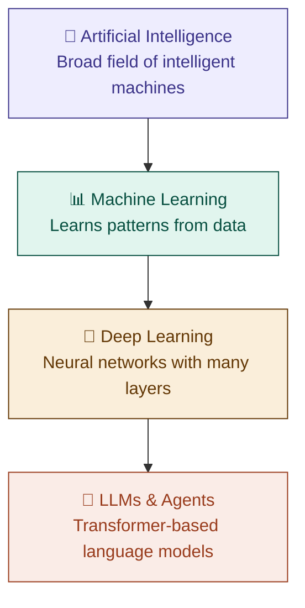

# 00 — Core Concepts & ML Vocabulary

> A complete reference of foundational ML terms — definitions written for depth, not just recall. Use this before interviews to refresh the vocabulary that underpins every algorithm and technique in this repo.

---

## The big picture — where ML fits

| Term | Definition |
|------|-----------|
| **Artificial Intelligence (AI)** | The broad field of building systems that can perform tasks typically requiring human intelligence — reasoning, perception, language understanding, decision-making. ML is one approach to building AI; rule-based systems, search algorithms, and symbolic reasoning are others. |
| **Machine Learning (ML)** | A subset of AI where systems learn patterns directly from data rather than being explicitly programmed with rules. The key insight: instead of a human writing every decision rule, the algorithm discovers rules automatically by optimising a mathematical objective over examples. |
| **Deep Learning (DL)** | A subset of ML using artificial neural networks with many layers. The depth (many layers) allows the network to learn increasingly abstract representations — early layers detect simple patterns, deeper layers combine them into complex ones. Especially powerful for unstructured data: images, audio, text. |

---

## Data vocabulary

| Term | Definition |
|------|-----------|
| **Data** | The raw material ML learns from. Structured as a table of rows (instances) and columns (features), where each row represents one real-world observation. Quality, quantity, and representativeness of data often matters more than algorithm choice. |
| **Instance** | A single row in your dataset — one complete observation. Also called example, observation, or sample. In a housing dataset, one instance is one house with all its recorded attributes. |
| **Feature** | A single measurable input variable used to make predictions. Also called input, predictor, or independent variable. Features are what the model sees. For a house: size, number of bedrooms, location, age. Choosing and engineering good features is often the highest-leverage work in an ML project. |
| **Target** | The variable you are trying to predict — what the model outputs. Also called output, label, or dependent variable. The target is what the model learns to approximate. In house price prediction: the sale price. In spam detection: spam or not spam. |
| **Label** | The known correct answer attached to a training instance in supervised learning. Labels are what the model is trained against — it adjusts its parameters to make its predictions match the labels as closely as possible. Also called class (in classification) or target value (in regression). |
| **Training data** | The portion of your dataset the model learns from. The model sees both the features and the labels during training and adjusts its internal parameters to fit this data. It should be representative of the real distribution — a biased training set produces a biased model. |
| **Test data** | A held-out portion of your dataset the model never sees during training. Used only to evaluate final performance — it simulates how the model will perform on genuinely new, unseen data in production. Never use test data to make training decisions; that contaminates the evaluation. |
| **Validation data** | A third split, separate from both training and test data. Used during training to tune hyperparameters and make model selection decisions — gives an honest signal of how changes affect generalisation without touching the test set. |
| **Noise** | Random, irrelevant variation in data that carries no real signal — measurement errors, random fluctuations, missing context. Noise cannot be learned and should not be. A model that learns noise is overfitting. Noise contributes to irreducible error — the floor below which no model can go regardless of complexity. |
| **Dimensionality** | The number of features in your dataset. High dimensionality creates the "curse of dimensionality" — data becomes sparse, distance metrics lose meaning, and models need exponentially more data to generalise. Dimensionality reduction techniques (PCA, t-SNE) address this. |

---

## Model vocabulary

| Term | Definition |
|------|-----------|
| **Algorithm** | The mathematical procedure or recipe used to learn from data. The algorithm defines *how* the model is trained — what objective it optimises, how it updates parameters, and what structure it can represent. Gradient descent and backpropagation are algorithms. A decision tree's splitting procedure is an algorithm. |
| **Model** | The learned artifact produced by running an algorithm on training data. A model is a mathematical function that maps input features to predictions. Before training it has random or default parameters; after training its parameters encode the patterns found in the data. |
| **Model fitting** | The process of training — adjusting a model's parameters iteratively until it describes the training data well according to the chosen loss function. "Fitting" captures the idea that you're making the model's predictions conform to the shape of the data. |
| **Model complexity** | How flexible and expressive a model is — its capacity to represent different patterns. A linear model (straight line) is low complexity. A deep neural network with millions of parameters is very high complexity. Complexity directly drives the bias-variance tradeoff: more complexity = lower bias, higher variance. → See [`01-bias-variance-tradeoff`](../01-bias-variance-tradeoff/README.md) |
| **Parameter** | A value *inside* the model that is learned from data during training. Parameters define the model's learned function — in linear regression these are the slope and intercept; in neural networks these are the weights and biases. The entire training process is about finding the right parameter values. |
| **Hyperparameter** | A value *you* set before training begins that controls how the model learns — not learned from data, but chosen by the engineer. Examples: learning rate, number of trees in a random forest, depth of a decision tree, number of layers in a neural network. Hyperparameter tuning is the process of finding optimal values, usually via grid search or random search. |

---

## Training vocabulary

| Term | Definition |
|------|-----------|
| **Cost function** | A mathematical function that measures how wrong the model's current predictions are across the training data. Also called loss function or objective function. The training process is entirely about minimising this number. Common examples: Mean Squared Error for regression, Cross-Entropy for classification. The choice of cost function encodes what "wrong" means for your specific problem. → Covered in depth in [`02-linear-regression`](../02-linear-regression/README.md) |
| **Gradient descent** | The optimisation algorithm used to minimise the cost function. It works by computing the gradient (slope) of the cost function with respect to each parameter, then nudging each parameter slightly in the opposite direction of the gradient — downhill toward the minimum. Repeat thousands of times and the model converges to a good solution. The backbone of almost all modern ML training. → Covered in depth in [`02-linear-regression`](../02-linear-regression/README.md) |
| **Learning rate** | A hyperparameter that controls the size of each step in gradient descent. Too high: the model overshoots the minimum and diverges. Too low: training takes forever and may get stuck. Finding the right learning rate is one of the most important hyperparameter decisions in any ML project. → Covered in depth in [`02-linear-regression`](../02-linear-regression/README.md) |
| **Batch** | A subset of the training data used to compute one gradient descent update. Instead of using the full dataset for every update (slow) or just one example (noisy), mini-batch gradient descent uses small batches (typically 32–256 examples) — balancing speed and stability. → Covered in depth in [`11-neural-network-fundamentals`](../11-neural-network-fundamentals/README.md) |
| **Epoch** | One complete pass through the entire training dataset. A model typically trains for many epochs — each time it sees the full dataset it refines its parameters further. The number of epochs is a hyperparameter; too few = underfitting, too many = overfitting. → Covered in depth in [`11-neural-network-fundamentals`](../11-neural-network-fundamentals/README.md) |
| **Iteration** | One single gradient descent update step using one batch. If your dataset has 1000 examples and batch size is 100, one epoch = 10 iterations. The relationship: Iterations per epoch = Training set size ÷ Batch size. → Covered in depth in [`11-neural-network-fundamentals`](../11-neural-network-fundamentals/README.md) |

---

## Feature vocabulary

| Term | Definition |
|------|-----------|
| **Feature engineering** | The process of creating new, more informative features from raw data using domain knowledge. Examples: extracting "day of week" from a timestamp, combining "height" and "weight" into "BMI", creating interaction terms. Often more impactful than switching algorithms — a mediocre algorithm with great features usually beats a great algorithm with poor features. → Covered in depth in [`02-linear-regression`](../02-linear-regression/README.md) |
| **Feature scaling** | Transforming feature values so they are on a comparable scale. Critical for distance-based algorithms (k-NN, SVM) and gradient-based algorithms (linear regression, neural networks) where large-magnitude features dominate. Tree-based algorithms (random forests, XGBoost) do not require scaling. → Covered in depth in [`02-linear-regression`](../02-linear-regression/README.md) |
| **Normalisation** | A feature scaling technique that maps values to a [0, 1] range: `(x - min) / (max - min)`. Best used when you know the approximate bounds of the data and the distribution is not Gaussian. Sensitive to outliers — one extreme value compresses everything else. |
| **Standardisation** | A feature scaling technique that transforms values to have mean=0 and standard deviation=1: `(x - mean) / std`. More robust than normalisation when data has outliers or an approximately Gaussian distribution. Generally the safer default choice. |
| **Dimensionality reduction** | Techniques that reduce the number of features while preserving as much useful information as possible. Useful for visualisation, removing noise, and speeding up training. Two flavours: linear (PCA) and non-linear (t-SNE, UMAP). → Covered in depth in [`08-kmeans-clustering`](../08-kmeans-clustering/README.md) |

---

## Evaluation vocabulary

| Term | Definition |
|------|-----------|
| **Evaluation** | The process of measuring how well a trained model performs on unseen data using quantitative metrics. The choice of metric matters enormously — accuracy can be misleading for imbalanced datasets, so precision, recall, F1, and AUC-ROC are often more informative. → Covered in depth in [`09-eval-metrics`](../09-eval-metrics/README.md) |
| **Validation** | Evaluating the model on a held-out validation set during training to make decisions about hyperparameters and model architecture. Validation gives an honest signal without contaminating the final test evaluation. → Covered in depth in [`09-eval-metrics`](../09-eval-metrics/README.md) |
| **Cross-validation** | A robust technique for estimating model performance by splitting data into k equal folds, training on k-1 folds, and testing on the remaining fold — repeated k times so every fold serves as the test set once. The k results are averaged for a more reliable estimate than a single train/test split. Especially valuable when data is limited. → Covered in depth in [`09-eval-metrics`](../09-eval-metrics/README.md) |

---

## Key concepts — covered in depth in their own topics

| Term | One-line definition | Deep dive |
|------|-------------------|-----------|
| **Supervised learning** | Learning from labelled data | → [`00-ml-landscape`](../00-ml-landscape/README.md) |
| **Unsupervised learning** | Finding patterns in unlabelled data | → [`00-ml-landscape`](../00-ml-landscape/README.md) |
| **Reinforcement learning** | Learning from rewards and penalties | → [`00-ml-landscape`](../00-ml-landscape/README.md) |
| **Bias** | Error from a model being too simple — underfitting | → [`01-bias-variance-tradeoff`](../01-bias-variance-tradeoff/README.md) |
| **Variance** | Error from a model memorising noise — overfitting | → [`01-bias-variance-tradeoff`](../01-bias-variance-tradeoff/README.md) |
| **Regularisation** | Penalising model complexity to reduce overfitting | → [`10-regularisation`](../10-regularisation/README.md) |
| **Batch normalisation** | Normalising layer inputs during neural net training for stability | → [`11-neural-network-fundamentals`](../11-neural-network-fundamentals/README.md) |
| **Dropout** | Randomly deactivating neurons during training to prevent overfitting | → [`11-neural-network-fundamentals`](../11-neural-network-fundamentals/README.md) |
| **Activation function** | Non-linear function applied at each neuron to enable complex representations | → [`11-neural-network-fundamentals`](../11-neural-network-fundamentals/README.md) |
| **Backpropagation** | Algorithm for computing gradients through a neural network layer by layer | → [`11-neural-network-fundamentals`](../11-neural-network-fundamentals/README.md) |
| **Attention mechanism** | Allows a model to weigh which parts of input are most relevant for each output | → [`12-transformer-architecture`](../12-transformer-architecture/README.md) |
| **Embedding** | A dense vector representation of discrete data (tokens, words, users) in continuous space | → [`12-transformer-architecture`](../12-transformer-architecture/README.md) |
| **Fine-tuning** | Continuing to train a pre-trained model on new, task-specific data | → [`13-llm-finetuning`](../13-llm-finetuning/README.md) |
| **RAG** | Retrieval-Augmented Generation — grounding LLM responses with retrieved external knowledge | → [`14-rag-pipeline`](../14-rag-pipeline/README.md) |

---

*Part of [ml-dl-for-ai-engineers](https://github.com/PulkitKushwaha/ml-dl-for-ai-engineers) — a learning journal built while targeting Agentic AI Engineer roles at product companies.*
