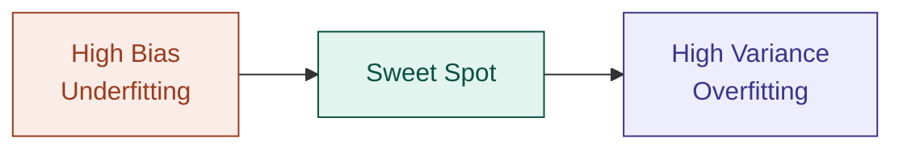
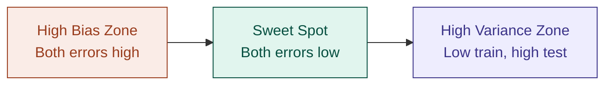

# 01 — Bias-Variance Tradeoff

> **Week 1 · Topic 1** · The concept that explains why models fail — and how to fix them.

---

## The core idea

Every model can be wrong in two fundamentally different ways — too simple (bias) or too sensitive to training data (variance). Reducing one tends to increase the other. Finding the sweet spot between them is the central challenge of every ML problem.

**The one-line diagnostic:** look at the gap between training error and test error.

| Training error | Test error | Diagnosis |
|----------------|------------|-----------|
| High | High (close to training error) | High bias — underfitting |
| Low | High (large gap from training error) | High variance — overfitting |
| Low | Low (close to training error) | Sweet spot ✅ |

---

## The recording studio analogy

**High variance (overfitting)** — you rehearse a song 500 times in the exact same room, same gear, same tempo. You nail that one version perfectly. Then you step into the studio — different acoustics, slightly different tempo from nerves, producer asks for a key change. You fall apart. You memorised the rehearsal, not the song.

**High bias (underfitting)** — you walk in having run through the song only twice. You don't know it well enough to play it cleanly even under ideal conditions. Wrong notes, losing the rhythm, forgetting the bridge.

**The sweet spot** — you know the song well enough to play it confidently, but you're flexible enough to adapt to a new room, a key change, a different tempo. You generalised. That's the take that makes the album.

---

## Visual: the bias-variance spectrum

| | High Bias | Sweet Spot | High Variance |
|---|---|---|---|
| **Also called** | Underfitting | Balanced | Overfitting |
| **Model is** | Too simple | Just right | Too complex |
| **Training error** | High | Low | Low |
| **Test error** | High | Low | High |
| **Gap between them** | Small | Small | Large |

---

## Visual: the classic error curve

**Reading the curve:**
- **Training error** — starts high, keeps falling as complexity increases, never really goes back up
- **Test error** — starts high, falls, hits a minimum (sweet spot), then rises again as the model memorises noise
- **The gap** between the two curves is your variance. The height of both curves near the start is your bias.

---

## How to fix each problem

| Problem | Cause | Fixes |
|---------|-------|-------|
| **High Bias** (underfitting) | Model too simple | More complex model · Add features · Reduce regularisation |
| **High Variance** (overfitting) | Memorising noise | Simplify model · Add regularisation L1/L2 · Dropout (neural nets) · More data · Ensemble methods |

> ⚠️ These fixes are mirror opposites. Always diagnose which side you're on before applying a fix.

---

## The formal decomposition

Total Error = Bias² + Variance + Irreducible Error

**Irreducible error** is noise in the data itself that no model can eliminate.

**Classic interview gotcha:** *"If you had infinite data and a perfect model, could you reach 0% error?"*
→ No. Irreducible error always remains.

---

## This applies beyond just swapping algorithms

| What you change | Effect |
|----------------|--------|
| Increase training data | Reduces variance, does not fix bias |
| Add more features | Reduces bias |
| Increase regularisation | Reduces variance, increases bias |
| Increase model complexity | Reduces bias, increases variance |
| Reduce tree depth | Reduces variance |
| Increase number of layers | Reduces bias, increases variance |

---

## Why ensemble methods exist — bridge to Topics 5 & 6

- **Bagging** (Random Forest) — reduces **variance** by averaging many high-variance models
- **Boosting** (XGBoost) — reduces **bias** by combining weak models sequentially, each correcting the last

---

## Learning curves — the practical diagnostic

- **Both curves high and close together** → bias problem
- **Large gap between the two curves** → variance problem

---

## ⚠️ Common confusions

**Mistake: "Train the model more" fixes high bias.**
It doesn't. More iterations do nothing for a model too simple to capture the pattern. The fix is increasing model capacity — not more training time.

**Mistake: "More data" fixes everything.**
More data only helps variance, not bias. Bias is a capability problem — a straight line will never fit a curve regardless of how many data points you add.

**The rule to lock in:**
- More data + regularisation + ensembles → fixes **variance**
- More features + more complex model + less regularisation → fixes **bias**

---

## Interview-ready summary

> "Bias-variance is the tradeoff between a model being too simple to capture real patterns (high bias / underfitting) versus too complex and memorising noise (high variance / overfitting). I diagnose it by comparing training vs test error — a small gap with both errors high means bias, a large gap means variance. The fixes are mirror opposites: bias needs more model capacity, variance needs less complexity or more regularisation. More data helps variance but never fixes bias. Random forests and XGBoost exist as engineered solutions to opposite sides of this tradeoff."

---

## Resources
- **Udemy:** Machine Learning A-Z — Kirill Eremenko (model evaluation sections)
- **YouTube:** StatQuest — "Bias and Variance"
- **YouTube:** StatQuest — "Machine Learning Fundamentals: Cross Validation"

---

*Part of [ml-dl-for-ai-engineers](https://github.com/PulkitKushwaha/ml-dl-for-ai-engineers)*
