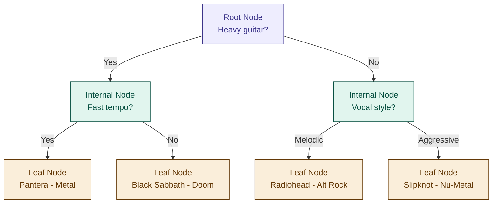

# 04 — Decision Trees

> **Week 1 · Topic 4** · The algorithm that thinks the way humans make decisions — and the foundation for Random Forests and XGBoost.

---

## The core idea

A decision tree learns a series of yes/no questions about your features, arranged in a tree structure, where following the branches from root to leaf gives you a prediction. It works for both classification and regression tasks.

The reason to understand decision trees deeply is not just the algorithm itself — Random Forests (Topic 5) are many decision trees averaged together to reduce variance, and XGBoost (Topic 6) chains decision trees sequentially to reduce bias. Every insight here carries forward directly.

---

## The record store analogy

You are at a vinyl record store and a friend wants a recommendation. You do not know their taste yet so you start asking questions:

> "Do you like music with heavy guitar?" → Yes
> "Do you prefer fast tempo or slow and brooding?" → Fast
> "Do you like aggressive vocals or melodic ones?" → Aggressive

You land on: "You would love Pantera's Far Beyond Driven."

You just ran a decision tree. Each question split your friend into a smaller, more specific group. Each answer eliminated a huge chunk of possibilities. By the end, you had enough information to make a confident prediction.

---

## The anatomy of a decision tree



- **Root node** — the very first split. The single most informative question about your data.
- **Internal nodes** — subsequent questions that further divide data into purer groups.
- **Branches** — the answers (yes/no or value thresholds) that route data left or right.
- **Leaf nodes** — the final predictions. No more questions asked here.

---

## How the tree chooses which question to ask

At every node the algorithm tries every possible split on every feature and picks the one that creates the purest children — groups where one class dominates most clearly. Two ways to measure purity:

---

## Gini Impurity — deep dive

### The concept

Imagine you reach into a record bin blindfolded and pull out a record, then try to guess what genre it is based purely on the bin's composition. If the bin contains only Metal records — you are never wrong. That bin is perfectly pure. **Gini = 0.**

If the bin has equal amounts of Metal, Pop, Jazz, and Classical — every pull is a guess. You will be wrong most of the time. That bin is perfectly impure. **Gini = maximum.**

Gini impurity answers: *"if I randomly picked a sample from this node and randomly assigned it a label based on the class distribution here, what is the probability I would be wrong?"*

### The formula

```
Gini = 1 − Σ(pᵢ)²
```

Where pᵢ is the proportion of samples belonging to class i.

### Worked example

Node contains 10 songs — 7 Metal, 3 Pop:

```
p(Metal) = 7/10 = 0.7
p(Pop)   = 3/10 = 0.3

Gini = 1 − (0.7² + 0.3²)
     = 1 − (0.49 + 0.09)
     = 1 − 0.58
     = 0.42
```

After a split — left child has 6 Metal, 1 Pop. Right child has 1 Metal, 2 Pop:

**Left child:**
```
p(Metal) = 6/7 ≈ 0.857  |  p(Pop) = 1/7 ≈ 0.143

Gini = 1 − (0.857² + 0.143²)
     = 1 − (0.734 + 0.020)
     = 0.245   ← much purer
```

**Right child:**
```
p(Metal) = 1/3 ≈ 0.333  |  p(Pop) = 2/3 ≈ 0.667

Gini = 1 − (0.333² + 0.667²)
     = 1 − (0.111 + 0.445)
     = 0.444   ← still fairly mixed
```

**Weighted Gini after split** (weighted by node size):
```
Weighted Gini = (7/10 × 0.245) + (3/10 × 0.444)
              = 0.172 + 0.133
              = 0.305
```

Original Gini was 0.42. After split it is 0.305. The split reduced impurity — this is a good split. The algorithm tries every possible split and picks the one that reduces Gini the most.

### The range
- Gini = 0 → perfectly pure (best possible)
- Gini = 0.5 → perfectly mixed for binary classification (worst possible)
- Gini never exceeds 0.5 for binary, or `1 − 1/k` for k classes

---

## Entropy & Information Gain — deep dive

### The concept

Entropy comes from information theory and measures disorder or surprise. If every record in a bin is Metal, there is zero surprise when you pull one out. Zero disorder. **Entropy = 0.** If the bin is 50% Metal and 50% Pop, every pull is a coin flip. Maximum surprise. **Entropy = 1** (for binary).

Information Gain measures how much a split reduces entropy — how much disorder is eliminated by asking that question.

### The formula

```
Entropy H = −Σ pᵢ · log₂(pᵢ)

Information Gain = H(parent) − Weighted average H(children)
```

### Worked example

Same node — 7 Metal, 3 Pop:

```
H = −(0.7 · log₂(0.7)) − (0.3 · log₂(0.3))
  = −(0.7 × −0.515) − (0.3 × −1.737)
  = 0.360 + 0.521
  = 0.881
```

**Left child entropy** (6 Metal, 1 Pop):
```
H = −(6/7 · log₂(6/7)) − (1/7 · log₂(1/7))
  = −(0.857 × −0.222) − (0.143 × −2.807)
  = 0.190 + 0.401
  = 0.591
```

**Right child entropy** (1 Metal, 2 Pop):
```
H = −(1/3 · log₂(1/3)) − (2/3 · log₂(2/3))
  = −(0.333 × −1.585) − (0.667 × −0.585)
  = 0.528 + 0.390
  = 0.918
```

**Weighted entropy after split:**
```
Weighted H = (7/10 × 0.591) + (3/10 × 0.918)
           = 0.414 + 0.275
           = 0.689
```

**Information Gain:**
```
IG = 0.881 − 0.689 = 0.192
```

Positive information gain means this split is useful — it reduced disorder. Higher IG = better split.

---

## Gini vs Entropy — comparison

| | Gini Impurity | Entropy / Info Gain |
|---|---|---|
| **Formula** | 1 − Σ(pᵢ)² | −Σ pᵢ · log₂(pᵢ) |
| **Range (binary)** | 0 to 0.5 | 0 to 1.0 |
| **Pure node** | Gini = 0 | Entropy = 0 |
| **Mixed node** | Gini = 0.5 | Entropy = 1.0 |
| **Speed** | Faster — no log calculation | Slower — log₂ is computationally expensive |
| **Tendency** | Isolates most frequent class | Produces more balanced trees |
| **Default in** | scikit-learn | ID3, C4.5 algorithms |
| **Use when** | Speed matters, default choice | Need calibrated probability estimates |
| **Practical difference** | Usually produces nearly identical trees — do not overthink the choice | |

---

## Tree depth and overfitting

| Depth | Problem | Result |
|---|---|---|
| Too deep | Memorises training data — every leaf has one sample | Perfect train accuracy, terrible test accuracy. High variance. |
| Just right | Generalises well — leaves have enough samples to represent real patterns | Low bias, low variance |
| Too shallow | Misses real patterns — not enough questions asked | High bias. Underfitting. |

A single fully grown decision tree is one of the highest-variance models in ML. This is exactly why Random Forests and XGBoost were invented.

---

## Pruning — preventing overfitting

### Pre-pruning (Early Stopping)

Set constraints before training that prevent the tree from growing too deep.

**Key hyperparameters:**

```python
max_depth = 3           # Maximum levels in the tree. Start here first.
min_samples_split = 20  # Node must have >= 20 samples to be split at all
min_samples_leaf = 10   # Every leaf must contain >= 10 samples
max_features = "sqrt"   # Consider only sqrt(n_features) at each split
```

- `max_depth` — most impactful. Start with 3–5 and tune via cross-validation.
- `min_samples_split` — prevents splitting on tiny, unrepresentative groups.
- `min_samples_leaf` — rejects splits that would create undersized leaves. Very effective at smoothing decision boundaries.
- `max_features` — adds randomness, reduces overfitting. Also central to how Random Forests work.

**Pros:** fast, simple, computationally cheap.
**Cons:** may stop too early and underfit — decisions made without seeing the full tree.

### Post-pruning (Cost Complexity Pruning)

Grow the full tree first, then work backwards removing branches that do not justify their complexity.

**The Cost Complexity criterion:**

```
Cost(T) = Error(T) + α × |T|
```

- `Error(T)` — misclassification rate on validation data
- `|T|` — number of leaf nodes (complexity measure)
- `α` (ccp_alpha) — pruning strength. α=0 keeps full tree. Larger α = more aggressive pruning.

**In scikit-learn:**
```python
path = tree.cost_complexity_pruning_path(X_train, y_train)
ccp_alphas = path.ccp_alphas
trees = [DecisionTreeClassifier(ccp_alpha=a).fit(X_train, y_train) for a in ccp_alphas]
# Pick best alpha via cross-validation
```

**Pros:** more principled — you see the full tree before deciding what to cut.
**Cons:** computationally more expensive.

### Pre vs Post — when to use which

| | Pre-pruning | Post-pruning |
|---|---|---|
| **When** | Large datasets where full training is slow | Smaller datasets where you can grow the full tree |
| **Tuning** | Set hyperparameters before training | Tune ccp_alpha after training |
| **Risk** | May underfit — stopped too early | May overfit if alpha is too small |
| **In practice** | Most common in production | More principled, worth knowing for interviews |

---

## Feature importance — a free gift from trees

Decision trees naturally rank features by importance. Features used closer to the root and more frequently contribute more to predictions.

```python
tree.feature_importances_   # available on any scikit-learn tree model
```

Use this to identify which features drive predictions and which are noise — free feature selection built in.

**Caveat:** when features are correlated, importance is split between them, making each look less important than it is. Use with awareness of this limitation.

---

## Key properties of decision trees

| Property | Detail |
|---|---|
| **No feature scaling needed** | Trees split on thresholds not magnitudes — "BPM > 140" works identically whether BPM is normalised or raw |
| **Handles mixed feature types** | Works with numerical and categorical features without preprocessing |
| **Highly interpretable** | You can draw and explain the tree to a non-technical stakeholder |
| **Non-linear** | Captures complex non-linear relationships without polynomial features |
| **High variance** | A single deep tree overfits badly — this is why Random Forests exist |
| **No gradient descent** | Trees use greedy splitting, not gradient descent — no loss function, no calculus |

---

## ⚠️ Common confusions

**Confusion: are Gini/entropy the same as gradient descent for trees?**

This is a great instinct — both serve the same *purpose* (guiding the algorithm toward a better model) but through completely different mechanisms.

Gradient descent works on continuous parameters (weights), makes small incremental adjustments using calculus, and runs iteratively thousands of times — converging gradually toward a global minimum.

Gini and entropy work on discrete decisions (which feature, which threshold), make one greedy choice per node by evaluating every possible split and picking the best one right now, and never revisit that decision. This is called **greedy search** — locally optimal at each node, not guaranteed to be globally optimal across the whole tree.

The analogy: gradient descent is a compass that continuously adjusts your heading as you walk. Gini/entropy is a scout who looks at every possible path from your current position, picks the best one, and you never turn back. Same goal — different mechanism entirely.

**Mistake: thinking decision trees need feature scaling.**
They do not. Unlike gradient-based algorithms, trees ask threshold questions on raw values. Magnitude is irrelevant.

**Mistake: growing the full tree without pruning.**
A fully grown tree creates one leaf per training sample — perfect training accuracy, terrible generalisation. Always set at least `max_depth` before training.

**Mistake: confusing Gini and entropy as very different.**
In practice they produce nearly identical trees. Gini is faster and is the scikit-learn default. Use entropy when you need well-calibrated probability estimates.

**Mistake: treating feature importance as ground truth.**
When features are correlated, importance is split between them making each look less important than it is.

---

## Interview-ready summary

> "A decision tree learns a series of threshold questions on features, arranged hierarchically, where following branches from root to leaf gives a prediction. At each node it picks the split that maximally reduces impurity — measured by Gini (probability of misclassifying a random sample) or Information Gain (reduction in entropy/disorder). Unlike gradient descent which iteratively adjusts continuous weights, trees use greedy search — evaluating every possible split at each node and picking the locally best one. Trees do not need feature scaling since they split on thresholds not magnitudes. The main weakness is high variance — a fully grown tree memorises training data. Pre-pruning controls this via max_depth and min_samples_leaf. Post-pruning grows the full tree then removes branches via the ccp_alpha penalty. Decision trees are the building block for Random Forests (bagging — reduces variance) and XGBoost (boosting — reduces bias)."

---

## Resources
- **Udemy:** Machine Learning A-Z — Kirill Eremenko (Part 3: Classification — Decision Tree section)
- **YouTube:** StatQuest — "Decision Trees, Clearly Explained"
- **YouTube:** StatQuest — "Gini Impurity, Clearly Explained"
- **YouTube:** StatQuest — "Information Gain, Clearly Explained"

---

*Part of [ml-dl-for-ai-engineers](https://github.com/PulkitKushwaha/ml-dl-for-ai-engineers) — a learning journal built while targeting Agentic AI Engineer roles at product companies.*
