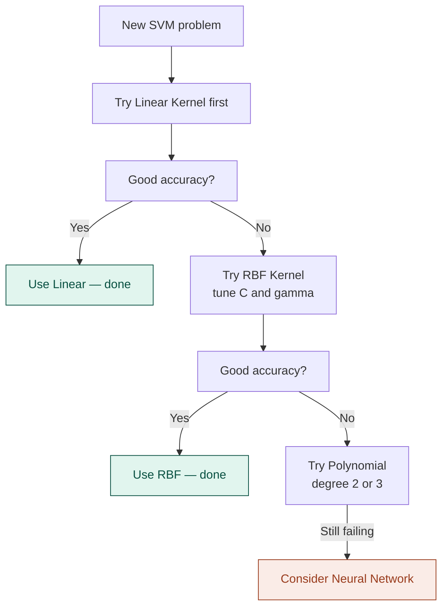

# 07 — k-NN & SVM

> **Week 1 · Topic 7** · Two very different algorithms that share one critical property — both are completely distance-based and both break without feature scaling.

---

## The core idea

k-NN and SVM look nothing alike on the surface but share a fundamental property: both make decisions based entirely on distances between data points. Feature scaling is not optional for either — it is mandatory. An unscaled feature with a large range will dominate distance calculations and destroy predictions.

- **k-NN:** classifies a new point by finding its k nearest neighbours in training data and taking a majority vote. No training phase — memorises the entire dataset.
- **SVM:** finds the decision boundary that maximises the margin between classes. Uses support vectors — the data points closest to the boundary — to define it.

---

## Part 1 — k-Nearest Neighbours (k-NN)

### The vibe check analogy

You walk into a record store in an unfamiliar city and want to know — is this a Metal store or a Pop store? You do not read any signs. You just look at the 5 nearest people to you. Four are wearing band tees, have long hair, and are flipping through Metallica records. One is listening to Taylor Swift. Majority vote: Metal store.

That is k-NN. Classify a new point by looking at its k nearest neighbours and taking a vote. No model, no training, no learned parameters — just memorise the training set and measure distances at prediction time.

### How k-NN works

```
Step 1 — Store the entire training dataset (no learning happens)
Step 2 — Receive a new data point to classify
Step 3 — Calculate distance from the new point to every training point
         Most common: Euclidean distance = √Σ(xᵢ − yᵢ)²
Step 4 — Find the k nearest neighbours (smallest distances)
Step 5 — Majority vote (classification) or average (regression)
         That is the prediction
```

### Choosing k — the critical hyperparameter

| k value | Effect | Risk |
|---|---|---|
| k=1 (too small) | Extremely sensitive to noise — one outlier changes prediction | High variance, overfitting |
| k=√n (sweet spot) | Balances sensitivity and smoothness | Good generalisation |
| k very large | Considers too many distant, irrelevant neighbours | High bias, underfitting |

- Always use odd k for binary classification to avoid ties
- Tune via cross-validation
- Rule of thumb starting point: k = √(number of training samples)

### The curse of dimensionality — why k-NN breaks in high dimensions

In low dimensions (2–3 features), nearest neighbours is intuitive — nearby points share similar characteristics.

As dimensions increase, something strange happens: **all points become approximately equidistant from each other.** The concept of "nearest" loses meaning — every point is about as far from every other point.

```
2D:   need ~3% of data to cover 10% of the feature range
10D:  need ~80% of data to cover 10% of the feature range
100D: need essentially all data
```

Distance-based methods require exponentially more data as dimensions grow. k-NN works well with few features (< 20) and small-to-medium datasets. It breaks on high-dimensional data like raw text, images, or embeddings — dimensionality reduction (PCA, t-SNE) must come first.

### k-NN strengths and weaknesses

| Strengths | Weaknesses |
|---|---|
| No training phase — instant to set up | Slow at prediction — computes distance to all training points |
| Naturally handles multiclass | Memory intensive — stores entire training set |
| Non-parametric — no assumptions about distribution | Breaks in high dimensions (curse of dimensionality) |
| Simple to understand and implement | Feature scaling mandatory |
| Adapts to complex irregular decision boundaries | Poor on imbalanced datasets without weighting |

### When to use k-NN in practice

- Small datasets with few features (< 20)
- Quick baseline for classification or regression
- When interpretability matters — "nearest neighbours" is intuitive to explain
- Recommendation systems (conceptually — find similar items)

**Avoid in production** when: dataset is large (slow prediction), features are many (curse of dimensionality), or real-time inference is needed.

---

## Part 2 — Support Vector Machine (SVM)

### The widest street analogy

You are a city planner drawing a road to separate the Metal district from the Pop district. You could draw hundreds of roads that technically separate them. But you want the **widest possible road** — maximum space on both sides before hitting a building. Why? A wider road means new arrivals are more likely to end up on the correct side even if slightly off.

The buildings right next to the road — the ones constraining how wide it can be — are the **support vectors**. Everything else is irrelevant. Remove any non-support-vector and the road does not change. Support vectors are the only training points that matter for defining the boundary.

That wide road is the **maximum margin hyperplane** — what SVM optimises for.

### What SVM is optimising

SVM finds the hyperplane (line in 2D, plane in 3D, hyperplane in nD) that separates classes with the **maximum margin** — the widest possible gap between classes.

**Support vectors** are the actual training data points sitting closest to the decision boundary on each side. They define where the boundary sits. Remove any other training point and the boundary does not move. This makes SVM memory-efficient at prediction time — only support vectors are needed.

**Why maximum margin?** A wider margin = more robust boundary = new points slightly off from their class distribution are more likely to land correctly. Maximum margin = maximum generalisation confidence.

### The kernel trick — handling non-linear data

What if classes cannot be separated by a straight line — like Metal fans and Pop fans mixed in a circular pattern?

The kernel trick: instead of explicitly mapping data to a higher-dimensional space (expensive), SVM uses a kernel function that **computes the dot product in that higher-dimensional space without ever going there.** Mathematical shortcut — all the separation power of higher dimensions at a fraction of the cost.

Analogy: Metal fans and Pop fans are mixed in a flat 2D room — no straight line separates them. Give everyone a platform based on some feature (how loud they are). In 3D, elevated Metal fans and ground-level Pop fans can now be separated by a flat horizontal plane. The kernel does this lifting implicitly — without physically building the platforms.

### Kernels in detail

**Linear Kernel**
```
K(x, y) = x · y
```
Draws a straight hyperplane between classes. Like the city planner drawing a straight road along a natural river boundary.

- Use when: data is linearly separable, many features (text classification), speed is critical
- Avoid when: classes are mixed or have complex boundaries
- Always try this first as your baseline

**RBF Kernel (Radial Basis Function) — default in scikit-learn**
```
K(x, y) = exp(−γ||x − y||²)
```
Every training point has an influence bubble. Points inside a sample's bubble are pulled toward that class. Gamma controls bubble size.

- Small gamma → large bubbles → wide influence → smooth boundary → risk of underfitting
- Large gamma → small bubbles → tight influence → complex boundary → risk of overfitting

```
gamma too large  → tiny bubbles → boundary snakes around every point → overfitting
gamma too small  → huge bubbles → boundary too smooth → underfitting
gamma = "scale"  → 1/(n_features × X.var()) → good automatic default
```

- Use when: data is not linearly separable, unknown structure, medium datasets
- Most powerful and most common general-purpose kernel

**Polynomial Kernel**
```
K(x, y) = (γ · x · y + r)^d
```
Draws curved boundaries — parabolas, S-curves — depending on degree d.

- degree=2 → quadratic (parabola)
- degree=3 → cubic (S-curve)
- Use when: domain knowledge suggests polynomial relationship, NLP, image classification
- Watch out: higher degrees = more complex = more overfitting risk

**Sigmoid Kernel**
```
K(x, y) = tanh(γ · x · y + r)
```
Behaves like a two-layer neural network. Rarely used in practice — can be unstable. Mention it exists but do not reach for it.

### Kernel selection flowchart



### The C hyperparameter — hard vs soft margin

SVM wants two conflicting things: maximise the margin AND classify all training points correctly. C controls this trade-off.

**The studio budget analogy:**
C is your budget for fixing recording mistakes. High C = unlimited budget = fix every single imperfection = overproduced album that loses its soul (overfitting). Low C = tight budget = accept some imperfections, focus on overall feel = album ships and generalises well.

```
High C (e.g. C=100):
→ Heavily penalised for any misclassification
→ Squeezes margin very tight to avoid errors
→ Complex, narrow boundary
→ Fits training data almost perfectly
→ Risk: high variance, overfitting

Low C (e.g. C=0.01):
→ Barely penalised for misclassifications
→ Allows points on wrong side (soft margin)
→ Prioritises wide, smooth boundary
→ Accepts some training errors
→ Risk: high bias, underfitting
```

### C and gamma interaction (RBF kernel)

| C | Gamma | Result |
|---|---|---|
| High | High | Very complex wiggly boundary — severe overfitting |
| High | Low | Complex overall shape but smooth locally |
| Low | High | Simple overall shape but tight locally |
| Low | Low | Very smooth simple boundary — may underfit |

Always tune C and gamma together using grid search with cross-validation:

```python
from sklearn.model_selection import GridSearchCV
from sklearn.svm import SVC

param_grid = {
    'C': [0.1, 1, 10, 100],
    'gamma': [1, 0.1, 0.01, 0.001],
    'kernel': ['rbf']
}
grid = GridSearchCV(SVC(), param_grid, cv=5, scoring='accuracy')
grid.fit(X_train, y_train)
print(grid.best_params_)
```

### Diagnosing C and gamma problems

| Symptom | Diagnosis | Fix |
|---|---|---|
| High train accuracy, low test accuracy | C too high or gamma too high — overfitting | Decrease C, decrease gamma |
| Low train AND test accuracy | C too low or gamma too low — underfitting | Increase C, increase gamma |
| Boundary very wiggly | Both too high | Decrease both |
| Boundary too smooth, misses patterns | Both too low | Increase both |

---

## k-NN vs SVM — full comparison

| Property | k-NN | SVM |
|---|---|---|
| **Training** | None — lazy learner | Finds optimal hyperplane — can be slow |
| **Prediction speed** | Slow — computes all distances | Fast — only support vectors needed |
| **Memory** | High — stores all training data | Low — stores only support vectors |
| **Feature scaling** | Mandatory | Mandatory |
| **High dimensions** | Breaks — curse of dimensionality | Works well — kernel trick helps |
| **Non-linear data** | Handles naturally | Handles via kernel trick |
| **Interpretability** | High — nearest neighbours is intuitive | Low — hyperplane in high dimensions is abstract |
| **Best for** | Small datasets, low dimensions, quick baseline | Medium datasets, high dimensions, clear margin |
| **Avoid when** | Large datasets, many features, speed needed | Very large datasets — training scales poorly |

---

## ⚠️ Common confusions

**Confusion: k-NN works well with large datasets.**
The opposite is true at prediction time. k-NN has no training phase — "training" is instant. But prediction requires computing distances to every single training point. With millions of training samples, this becomes prohibitively slow. k-NN is suited to small-to-medium datasets where prediction speed is not critical.

**Confusion: a support vector is a line or boundary.**
Support vectors are actual training data points — the specific samples sitting closest to the decision boundary on each side. The boundary (hyperplane) is then positioned to maximise distance to these points. Remove any other training point and the boundary does not change. Support vectors are points, not lines.

**Confusion: feature scaling bias goes toward features with smaller ranges.**
The opposite — unscaled large-range features dominate distance calculations. If house size ranges from 100–5000 and room count from 1–10, a difference of 1000 in house size contributes 1000² to Euclidean distance while a difference of 5 rooms contributes only 25. House size completely drowns out room count. Always scale so all features contribute proportionally to distances.

**Confusion: decreasing C always fixes SVM problems.**
Decreasing C fixes overfitting (too complex boundary). If your SVM is underfitting — boundary too smooth, both train and test accuracy are low — you need to increase C, not decrease it. Diagnose first: are both errors high (underfit) or just test error (overfit)?

---

## Interview-ready summary

> "k-NN is a lazy learner — no training phase, memorises the entire dataset, classifies new points by majority vote of k nearest neighbours. Its strengths are simplicity and no assumptions about data distribution. Its weaknesses are slow prediction on large datasets and the curse of dimensionality — in high dimensions all points become approximately equidistant, making nearest neighbours meaningless. SVM finds the maximum margin hyperplane between classes, defined entirely by support vectors — the training points closest to the boundary. The kernel trick handles non-linear data by implicitly mapping to higher dimensions without the computational cost. C controls the margin-accuracy trade-off — high C prioritises classifying every training point correctly (narrow margin, overfitting risk), low C prioritises a wide margin and accepts some misclassifications (better generalisation). Both algorithms require feature scaling since both are distance-based — large-range features dominate distances and destroy predictions without scaling."

---

## Resources
- **Udemy:** Machine Learning A-Z — Kirill Eremenko (Part 3: Classification — k-NN and SVM sections)
- **YouTube:** StatQuest — "k-Nearest Neighbours, Clearly Explained"
- **YouTube:** StatQuest — "Support Vector Machines, Clearly Explained"
- **YouTube:** StatQuest — "The Kernel Trick in Support Vector Machines"

---

*Part of [ml-dl-for-ai-engineers](https://github.com/PulkitKushwaha/ml-dl-for-ai-engineers) — a learning journal built while targeting Agentic AI Engineer roles at product companies.*
