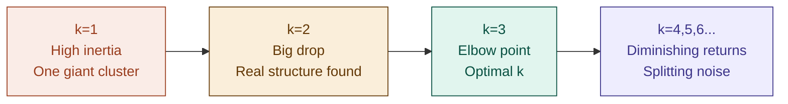

# 08 — k-Means Clustering

> **Week 1 · Topic 8** · The first unsupervised algorithm — no labels, no right answers, just finding hidden structure in data.

---

## The core idea

k-Means partitions data into k groups by iteratively assigning each point to its nearest centroid and moving centroids to the centre of their assigned points — until nothing changes. There are no labels, no loss function against ground truth, no accuracy to measure. The algorithm finds structure that exists naturally in the data.

This is the first algorithm in this repo that is fully unsupervised — and that changes everything about how you evaluate it, choose k, and interpret results.

---

## The festival analogy

You are a festival organiser. 1000 attendees are scattered across a huge field and you need to set up k water stations so everyone has one nearby. You know nothing about the attendees — no names, no preferences, no labels. Just where everyone is standing.

1. Drop k water stations randomly across the field
2. Every person walks to their nearest station — natural groups form
3. Move each station to the centre of its group (average position of everyone who walked to it)
4. Groups reform — some people now have a different nearest station
5. Move stations again to new centres
6. Repeat until nobody changes stations — equilibrium reached

The water stations are **centroids**. The groups are **clusters**. The process is the **iterative assignment and update** step. The algorithm finds the natural congregation points in the data.

---

## How k-Means works — 4 steps

```
Step 1 — Initialise k centroids
         Place k centroids randomly in feature space.
         Better: k-Means++ spreads them far apart to avoid bad initialisation.

Step 2 — Assign every point to its nearest centroid
         Compute Euclidean distance from each point to each centroid.
         Assign each point to the closest one — forms k clusters.

Step 3 — Move each centroid to the mean of its cluster
         Compute average position of all assigned points.
         Move the centroid there.

Step 4 — Repeat steps 2 and 3 until convergence
         Assignments stop changing — stable clusters found.
```

---

## What k-Means minimises — Inertia

Without labels, k-Means cannot compute accuracy. Instead it minimises **inertia** — the sum of squared distances from each point to its assigned centroid.

```
Inertia = Σ ||xᵢ − centroid_k||²  for all points xᵢ in cluster k
```

Low inertia = compact, tight clusters = good.
High inertia = loose, spread-out clusters = bad.

**Critical caveat:** inertia always decreases as k increases — with k equal to the number of data points, every point is its own centroid and inertia = 0. This is why you cannot use inertia alone to choose k. You need the elbow method or silhouette score.

---

## Choosing k — Method 1: The Elbow Method

### The concept

Run k-Means for k = 1, 2, 3... up to some reasonable maximum. Record inertia at each k. Plot inertia vs k. The curve drops sharply at first then flattens — the point where it bends like an elbow is the optimal k.



### Why the elbow works

Before the elbow: adding clusters meaningfully reduces inertia — you are splitting genuinely separate groups. Each new centroid captures a real dense region of data.

After the elbow: adding clusters barely helps — you are splitting noise or artificially dividing one real group into two. The inertia reduction per additional cluster becomes small and roughly constant.

The elbow is the point of maximum curvature — where the marginal benefit of one more cluster drops sharply.

### Practical implementation

```python
from sklearn.cluster import KMeans
import matplotlib.pyplot as plt

inertias = []
k_range = range(1, 15)

for k in k_range:
    km = KMeans(n_clusters=k, init='k-means++', n_init=10, random_state=42)
    km.fit(X_scaled)
    inertias.append(km.inertia_)

plt.plot(k_range, inertias, 'bo-')
plt.xlabel('Number of clusters k')
plt.ylabel('Inertia')
plt.title('Elbow Method')
plt.show()
```

### Limitations of the elbow method

- The elbow is not always obvious — sometimes the curve bends gradually with no clear kink
- Subjective — two people might identify different elbows on the same plot
- Does not measure cluster quality, only compactness
- Can be misleading when clusters have very different sizes or densities

When the elbow is ambiguous, use the silhouette score to validate or break the tie.

---

## Choosing k — Method 2: The Silhouette Score

### The concept

The silhouette score is a more rigorous, mathematically grounded way to evaluate clustering quality. Unlike inertia which only measures compactness, silhouette measures both **how tight** each cluster is and **how well separated** it is from other clusters simultaneously.

### How it works — for each data point

For a single data point i:

```
a(i) = average distance from point i to all other points in the same cluster
       (how well it fits its own cluster — lower is better)

b(i) = average distance from point i to all points in the nearest other cluster
       (how far it is from the closest wrong cluster — higher is better)

silhouette(i) = (b(i) − a(i)) / max(a(i), b(i))
```

### Reading the silhouette score

```
silhouette = +1.0  → point is perfectly placed — very close to its own cluster,
                     very far from the nearest other cluster

silhouette =  0.0  → point is on the boundary between two clusters —
                     equidistant from its own cluster and the nearest other

silhouette = -1.0  → point is misclassified — closer to another cluster
                     than to its own. It should have been assigned elsewhere.
```

The **overall silhouette score** is the average across all points. Higher average = better defined, better separated clusters.

### How to use it for choosing k

Run k-Means for multiple values of k. Compute the average silhouette score for each. Plot silhouette score vs k. Pick the k with the highest average silhouette score.

```python
from sklearn.metrics import silhouette_score

silhouette_scores = []
k_range = range(2, 15)   # silhouette undefined for k=1

for k in k_range:
    km = KMeans(n_clusters=k, init='k-means++', n_init=10, random_state=42)
    labels = km.fit_predict(X_scaled)
    score = silhouette_score(X_scaled, labels)
    silhouette_scores.append(score)

# Pick k with highest score
best_k = k_range[silhouette_scores.index(max(silhouette_scores))]
```

### Silhouette plots — going deeper

Beyond the average score, you can plot a **silhouette diagram** — a bar chart where each bar represents one data point, bars are coloured by cluster, and bar length = that point's silhouette score. This reveals:

- Clusters with many negative silhouette points → those points are misassigned
- Clusters with very different widths → uneven cluster sizes
- Ideal: all clusters roughly equal width, all bars mostly positive, average score high

### Elbow vs Silhouette — when to use which

| | Elbow Method | Silhouette Score |
|---|---|---|
| **What it measures** | Compactness (inertia) only | Compactness + separation |
| **Interpretation** | Visual — find the bend | Numerical — higher is better |
| **Ambiguity** | Can be subjective | More objective |
| **Computational cost** | Low | Higher — computes pairwise distances |
| **Best for** | Quick first pass to narrow down k range | Validating the elbow or breaking ties |
| **Limitation** | Does not measure separation | Slow on very large datasets |

**Best practice:** use the elbow method to narrow down candidate k values, then use silhouette score to pick the best one from those candidates.

---

## Limitations of k-Means

| Limitation | What happens | Fix |
|---|---|---|
| **Assumes spherical clusters** | Fails on ring, crescent, or elongated shapes — centroids end up in wrong positions | Use DBSCAN or Gaussian Mixture Models |
| **Assumes similar cluster sizes** | Splits large clusters instead of finding small ones | Use DBSCAN or adjust k |
| **Sensitive to initialisation** | Random centroids can lead to poor local minima | Use k-Means++ (default in scikit-learn) |
| **Requires k upfront** | Cannot discover k from data automatically | Use elbow + silhouette to estimate |
| **Sensitive to outliers** | Outliers pull centroids, distorting cluster boundaries | Remove outliers first or use k-Medoids |
| **Feature scaling required** | Distance-based — large-range features dominate | Always standardise before k-Means |

---

## k-Means vs DBSCAN

| Property | k-Means | DBSCAN |
|---|---|---|
| **Cluster shape** | Spherical only | Any shape — rings, crescents, blobs |
| **k required?** | Yes — must specify upfront | No — discovers automatically |
| **Outliers** | Assigns all points to a cluster | Labels outliers as noise explicitly |
| **Scales to large data** | Yes — efficient | Slower on very large datasets |
| **Evaluation** | Inertia, silhouette | Silhouette, visual inspection |
| **Best for** | Well-separated spherical clusters, known k | Arbitrary shapes, unknown k, anomaly detection |

---

## Real-world applications

**Customer segmentation:** group users by purchase behaviour, engagement, or listening history without predefined categories. Each cluster becomes a segment the product or marketing team designs for.

**Anomaly detection:** points far from any centroid (high distance to nearest cluster) are anomaly candidates — unusual transactions or outlier behaviour. Not a perfect tool for this (DBSCAN or Isolation Forest are better) but a useful signal.

**Data compression:** replace each point with its centroid. Classic application: image colour quantisation — represent a million colours with k representative colours, drastically reducing file size.

**Feature engineering:** cluster assignment becomes a new feature in a supervised model. "Which customer segment does this user belong to?" is a powerful input that captures group membership.

---

## Production approach — clustering 10M users with 50 features

```
1. Standardise all 50 features (z-score) — distance-based, scaling mandatory
2. Apply PCA — reduce to 10–15 components (curse of dimensionality applies)
3. Run k-Means for k=2 to 15 — plot elbow curve
4. Compute silhouette scores for candidate k values — pick highest
5. Run final model with k-Means++ initialisation and n_init=10
6. Interpret clusters — examine average feature values per cluster
7. Name each cluster based on dominant characteristics
```

---

## ⚠️ Common confusions

**Confusion: inertia alone can choose the optimal k.**
Inertia always decreases as k increases — at k = n_samples, inertia = 0. Minimising inertia alone always recommends as many clusters as data points. Use the elbow method to find diminishing returns, and silhouette score to validate cluster quality including separation.

**Confusion: k-Means works for anomaly detection.**
k-Means assigns every point to a cluster — it has no concept of "this point does not belong anywhere." Fraud cases and anomalies are rare, diverse, and do not form dense clusters. They will be absorbed into the nearest legitimate cluster. Use DBSCAN (labels outliers as noise) or Isolation Forest (dedicated anomaly detection) instead. Switch to supervised classification if labelled fraud examples are available.

**Confusion: unbalanced clusters always mean something went wrong.**
Sometimes one dominant group genuinely exists in the data and k-Means is telling you something real. Check whether scaling was applied first — if features are standardised and clusters are still heavily imbalanced, it may reflect the true data distribution. Interpret before assuming it is a bug.

**Confusion: k-Means does not need feature scaling.**
It does — distance-based like k-NN and SVM. Always standardise before running k-Means. A feature with range 0–50,000 will completely dominate distance calculations over a feature with range 0–1.

---

## Interview-ready summary

> "k-Means is an unsupervised clustering algorithm that partitions data into k groups by iteratively assigning points to their nearest centroid and moving centroids to the mean of their cluster until convergence. It minimises inertia — sum of squared distances to centroids — but inertia alone cannot choose k since it always decreases with more clusters. Use the elbow method to find where marginal inertia reduction drops sharply, and validate with the silhouette score which measures both compactness and separation — ranging from -1 (misclassified) to +1 (perfectly placed). k-Means assumes spherical, similarly-sized clusters, requires feature scaling, and is sensitive to outliers and initialisation — use k-Means++ by default. For non-spherical clusters or unknown k, use DBSCAN. For anomaly detection specifically, k-Means fails because it assigns all points to a cluster — use DBSCAN or Isolation Forest instead."

---

## Resources
- **Udemy:** Machine Learning A-Z — Kirill Eremenko (Part 4: Clustering — k-Means section)
- **YouTube:** StatQuest — "k-Means Clustering"
- **YouTube:** StatQuest — "Silhouette Analysis for k-Means Clustering"

---

*Part of [ml-dl-for-ai-engineers](https://github.com/PulkitKushwaha/ml-dl-for-ai-engineers) — a learning journal built while targeting Agentic AI Engineer roles at product companies.*
