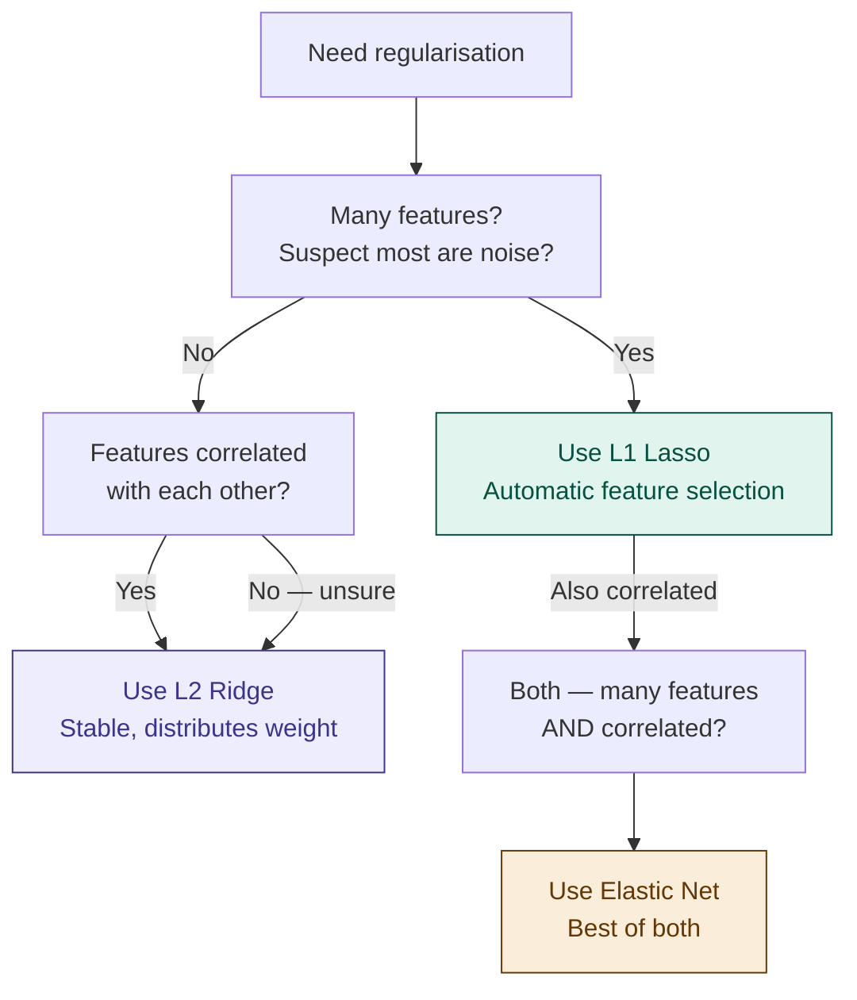

# 10 — Regularisation

> **Week 1 · Topic 10** · The technique that stops models from memorising noise — and the thread that connects every topic in Week 1.

---

## The core idea

Regularisation adds a penalty term to the loss function that discourages large weights — forcing the model to stay simple, generalise better, and stop memorising noise. It is the primary mathematical tool for controlling the bias-variance tradeoff from the variance side.

Regularisation has appeared in almost every topic this week — as the fix for high variance in bias-variance, as L1/L2 in linear regression, as the penalty term in XGBoost, as C in SVM, as max_depth in decision trees. This topic formally explains what it is and why it works.

---

## The recording studio analogy

You are producing a band's debut album. The guitarist is technically brilliant — he can play 47 different riffs and wants to use all of them in every song. The result is a cluttered, overproduced mess. The album overfits to his technical ability instead of serving the song.

Your job as producer: penalise complexity. Every unnecessary riff costs studio time and budget. The guitarist has to justify each one. If a riff does not meaningfully improve the song, it gets cut.

That is regularisation. The model is the guitarist. The weights are the riffs. The penalty is the budget. Large, complex weights are expensive — the model can use them, but only if they genuinely reduce the loss enough to justify the cost.

- **L1 regularisation** — strict producer: "If a riff is not pulling its weight, it is completely gone — silence." Drives weak weights to exactly zero.
- **L2 regularisation** — gentle producer: "Everyone can stay, but everyone plays quieter." Shrinks all weights toward zero without eliminating any.

---

## Why regularisation exists — the mathematical reason

Without regularisation, the training objective is simply: minimise loss on training data. A sufficiently complex model can always drive training loss to near zero — by memorising every training example including its noise. This is overfitting.

Regularisation adds a penalty term to the loss function:

```
Regularised loss = Original loss + λ × Penalty(weights)
```

Now the model faces a trade-off: it can reduce original loss by making weights large and complex — but that increases the penalty. The optimal solution balances: weights large enough to fit real patterns, small enough to avoid fitting noise.

**λ (lambda)** controls penalty strength:
- λ too high → penalty dominates → weights near zero → underfitting → high bias
- λ just right → balanced → generalises well → sweet spot
- λ too low → penalty negligible → model behaves unregularised → overfitting → high variance

Always tune λ via cross-validation — grid search over several orders of magnitude: [0.001, 0.01, 0.1, 1, 10, 100].

---

## L1 Regularisation — Lasso

```
Regularised loss = Loss + λ × Σ|wᵢ|
```

Penalty = sum of absolute values of all weights.

**The key property:** L1 drives weights to **exactly zero** — not close to zero, exactly zero. This means L1 performs automatic feature selection — irrelevant features get weights of exactly 0 and are effectively removed from the model.

**Why does L1 produce zeros?** The absolute value function has a sharp corner at zero. Mathematically, the gradient of |w| is undefined at w=0, which creates a "sticky" point that weights get pulled to and stay at. This is fundamentally different from the smooth quadratic penalty of L2.

**Use when:**
- You suspect many features are irrelevant and want automatic feature selection
- You need a sparse, interpretable model
- n_features >> n_samples (many more features than samples)
- You want to know which features actually matter

```python
from sklearn.linear_model import Lasso
model = Lasso(alpha=0.1)   # alpha = λ in scikit-learn
model.fit(X_train, y_train)
# Check which weights became exactly zero
print(model.coef_)
```

---

## L2 Regularisation — Ridge

```
Regularised loss = Loss + λ × Σwᵢ²
```

Penalty = sum of squared values of all weights.

**The key property:** L2 shrinks all weights toward zero but **never reaches exactly zero**. Every feature retains some influence, just reduced. No automatic feature selection — all features stay in the model.

**Why doesn't L2 produce zeros?** The squared penalty is smooth with a defined gradient everywhere including near zero — weights approach zero asymptotically but mathematically never reach it.

**Use when:**
- You believe most features are genuinely relevant
- Multicollinearity is present — when features are correlated, L2 distributes weight across them rather than arbitrarily picking one and zeroing others
- You want a stable, smooth model
- Default regularisation choice when unsure

```python
from sklearn.linear_model import Ridge
model = Ridge(alpha=1.0)   # alpha = λ in scikit-learn
model.fit(X_train, y_train)
```

---

## Elastic Net — combining L1 and L2

```
Regularised loss = Loss + λ₁ × Σ|wᵢ| + λ₂ × Σwᵢ²
```

Elastic Net combines both penalties. Gets the feature selection of L1 with the stability of L2 when features are correlated.

**l1_ratio parameter:** controls the mix.
- l1_ratio=0 → pure L2 (Ridge)
- l1_ratio=1 → pure L1 (Lasso)
- l1_ratio=0.5 → equal mix

**Use when:** many features, some correlated, want automatic selection without L1's instability under multicollinearity.

```python
from sklearn.linear_model import ElasticNet
model = ElasticNet(alpha=0.1, l1_ratio=0.5)
```

---

## L1 vs L2 — full comparison

| Property | L1 (Lasso) | L2 (Ridge) |
|---|---|---|
| **Penalty** | Σ\|wᵢ\| | Σwᵢ² |
| **Effect on weights** | Drives some to exactly zero | Shrinks all toward zero, never zero |
| **Feature selection** | Yes — automatic | No — all features retained |
| **Sparsity** | Sparse model | Dense model |
| **Multicollinearity** | Unstable — picks one correlated feature arbitrarily | Stable — distributes weight across correlated features |
| **Interpretability** | High — clear which features matter | Medium — all retained with reduced weights |
| **Use when** | Many irrelevant features, want selection | Most features relevant, multicollinearity present |
| **Default choice** | When sparsity is desired | General default — more stable |

---

## Regularisation and the bias-variance tradeoff

Regularisation directly controls the bias-variance tradeoff from the variance side:

```
Increasing λ → stronger penalty → smaller weights → simpler model
             → less variance (less overfitting)
             → more bias (model less expressive)

Decreasing λ → weaker penalty → larger weights allowed → more complex model
             → more variance (risk of overfitting)
             → less bias (model more expressive)
```

| λ value | Bias | Variance | Result |
|---|---|---|---|
| Too high | High | Low | Underfitting — model too simple |
| Just right | Low | Low | Sweet spot |
| Too low | Low | High | Overfitting — model memorises noise |

---

## Regularisation across all algorithms — the unified view

The same idea appears in every algorithm, just under different names:

| Algorithm | Regularisation mechanism | Parameter |
|---|---|---|
| **Linear / Logistic Regression** | L1 (Lasso), L2 (Ridge), Elastic Net added to loss | alpha (scikit-learn) |
| **Decision Trees** | max_depth, min_samples_leaf, min_samples_split limit complexity | max_depth, min_samples_leaf |
| **Decision Trees (post-pruning)** | Cost complexity pruning removes branches that do not justify complexity | ccp_alpha |
| **Random Forests** | max_features limits features per split — randomness-based regularisation | max_features, min_samples_leaf |
| **XGBoost** | Explicit L1 (reg_alpha), L2 (reg_lambda) on leaf weights. Gamma gates splits. | reg_alpha, reg_lambda, gamma |
| **SVM** | C is inverse of regularisation — low C = wide margin = more regularisation | C |
| **Neural Networks** | L1/L2 weight decay, dropout, batch normalisation | weight_decay, dropout rate — Week 2 |

**The key insight:** regularisation is not a specific technique — it is a **philosophy** applied differently across all algorithms. The goal is always the same: limit model complexity to improve generalisation.

---

## Choosing between L1, L2, and Elastic Net — decision guide



---

## ⚠️ Common confusions

**Confusion: L1 and L2 do the same thing — both shrink weights toward zero.**
The critical difference is that L1 reaches exactly zero (feature selection) and L2 never does (all features retained). This distinction matters enormously in practice — L1 gives you a sparse interpretable model, L2 gives you a dense stable one. Use L1 when you suspect irrelevant features, L2 when you want stability.

**Confusion: increasing lambda always helps.**
Increasing lambda increases bias. Too much regularisation makes the model too simple to capture real patterns — underfitting. The goal is the sweet spot, not maximum regularisation. If your model is already underfitting, do not increase lambda — decrease it or change the model entirely.

**Confusion: regularisation is only for linear models.**
Regularisation appears in every algorithm — max_depth and min_samples_leaf in trees, max_features in random forests, gamma and reg_lambda in XGBoost, C in SVMs, dropout and weight decay in neural networks. The concept is universal even when the implementation differs.

**Confusion: L1 is better than L2 because it does feature selection.**
Neither is universally better. L1 is unstable under multicollinearity — when features are correlated it arbitrarily picks one and zeros others. L2 handles correlated features gracefully. Use L1 when sparsity is genuinely desired. Use L2 as the default. Use Elastic Net when you need both.

---

## Interview-ready summary

> "Regularisation adds a penalty to the loss function proportional to weight magnitude — forcing the model to stay simple and generalise better. L1 (Lasso) penalises the sum of absolute weights, driving some to exactly zero and performing automatic feature selection — use when many features are irrelevant. L2 (Ridge) penalises the sum of squared weights, shrinking all toward zero without reaching it — use as the default, especially under multicollinearity. Elastic Net combines both. Lambda controls regularisation strength — increasing lambda increases bias and decreases variance, decreasing lambda does the opposite. The same concept appears across all algorithms: max_depth in trees, C in SVMs, gamma and reg_lambda in XGBoost, dropout in neural networks. When a model overfits, increasing regularisation (higher lambda, lower C, higher gamma, smaller max_depth) is always part of the fix."

---

## Resources
- **Udemy:** Machine Learning A-Z — Kirill Eremenko (regularisation sections in regression)
- **YouTube:** StatQuest — "Regularisation Part 1: Ridge Regression"
- **YouTube:** StatQuest — "Regularisation Part 2: Lasso Regression"
- **YouTube:** StatQuest — "Elastic Net Regression"

---

*Part of [ml-dl-for-ai-engineers](https://github.com/PulkitKushwaha/ml-dl-for-ai-engineers) — a learning journal built while targeting Agentic AI Engineer roles at product companies.*
