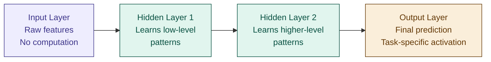

# 11 — Neural Network Fundamentals

> **Week 2 · Topic 11** · The architecture that powers everything from image recognition to GPT — built from surprisingly simple pieces.

---

## The core idea

A neural network is a stack of layers, each layer transforming its input through a weighted sum followed by a non-linear activation function. The whole thing learns by running gradient descent through every layer simultaneously via backpropagation.

Everything from Week 1 carries forward: gradient descent still drives learning, loss functions are the same, regularisation still applies, feature scaling is still mandatory. What changes is the architecture — how information flows through stacked layers to produce predictions.

---

## The guitar learning analogy

Think about how you learned to play guitar. When you first started, every decision was a separate conscious effort — which fret, which finger, how hard to press.

Over time your brain built layers of abstraction:
- Layer 1 — basic motor patterns: how to press a fret cleanly
- Layer 2 — combined those into chord shapes
- Layer 3 — combined chords into progressions
- Layer 4 — combined progressions into songs with feel and expression

By the time you were good, you were not thinking about fingers. You were thinking about emotion — and your hands executed it automatically. Complex output from stacked simple layers.

That is exactly what a neural network does. Early layers learn simple low-level patterns. Deeper layers combine those into increasingly abstract representations. The final layer produces the prediction.

For image recognition: edges → shapes → object parts → objects.
For text: characters → words → phrases → meaning.

No single layer is doing anything clever. Each one does a weighted sum and a simple non-linear transformation. The intelligence emerges from stacking them.

---

## The neuron — the basic unit

A single neuron does two things:

**Step 1 — Weighted sum:**
```
z = w₁x₁ + w₂x₂ + ... + wₙxₙ + b
```

**Step 2 — Activation function:**
```
output = activation(z)
```

Without the activation function, stacking layers is pointless. A weighted sum of weighted sums is still just a weighted sum:

```
Layer 1 output = W1 · x
Layer 2 output = W2 · (W1 · x) = (W2·W1) · x
Layer 3 output = W3 · (W2·W1·x) = (W3·W2·W1) · x
```

No matter how many layers — the result is always one matrix times x. That is linear regression. You could collapse the entire network into a single layer with no loss of expressive power.

The activation function introduces non-linearity — it makes the composition of layers genuinely more powerful than any single layer. This is the single most important insight in deep learning.

---

## Network structure — layers



- **Input layer** — receives raw features. No computation — just passes data in.
- **Hidden layers** — learn intermediate representations. Each neuron sees all outputs from the previous layer (fully connected). The "deep" in deep learning = many hidden layers.
- **Output layer** — final prediction. Activation depends on task: sigmoid for binary classification, softmax for multiclass, linear for regression.

---

## Activation functions

### Why non-linearity is everything

Without activation functions, any stack of linear layers collapses to a single linear transformation. No matter how many layers you add, the network can only learn linear relationships — identical to linear regression. Activation functions break this, giving the network the ability to learn any function given enough neurons and layers.

### ReLU — Rectified Linear Unit (default for hidden layers)

```
f(z) = max(0, z)
Derivative: 1 if z > 0, else 0
```

If input is negative output is 0, otherwise output = input. Simple, fast, computationally cheap. Default hidden layer activation for almost all modern networks.

**Why ReLU works:** when active (z > 0), the gradient passes through unchanged — multiplied by 1. No shrinking. Gradient can flow all the way back to the first layer without vanishing.

**Problem — dying ReLU:** if z is always ≤ 0 for a neuron, its gradient is always 0 — the neuron never activates and never updates. It is permanently "dead." Fix: Leaky ReLU.

### Leaky ReLU

```
f(z) = z if z > 0, else 0.01z
Derivative: 1 if z > 0, else 0.01
```

Small slope for negative inputs instead of zero — neurons can never fully die. Use when dying ReLU is observed (many weights stuck near zero, poor training).

### Sigmoid (output layer — binary classification)

```
f(z) = 1 / (1 + e⁻ᶻ)
Output range: 0 to 1
Derivative max: 0.25
```

Squashes output to 0–1 — interpretable as probability. Use in output layer for binary classification. **Avoid in hidden layers** — vanishing gradient (derivative max 0.25 means gradients shrink significantly at every layer).

### Tanh

```
f(z) = (eᶻ − e⁻ᶻ) / (eᶻ + e⁻ᶻ)
Output range: -1 to +1
```

Zero-centred output — better than sigmoid for hidden layers. Still suffers from vanishing gradient in very deep networks. Largely replaced by ReLU in practice.

### Softmax (output layer — multiclass classification)

```
f(zᵢ) = e^zᵢ / Σe^zⱼ
```

Converts raw scores into probabilities that sum to 1. Each class gets a probability — highest wins. Use in output layer when predicting one class from many (e.g. 10 music genres). Always pair with **categorical cross-entropy** loss — not MSE.

### Activation function selection guide

| Layer | Task | Activation | Loss function |
|---|---|---|---|
| Hidden layers | Any | ReLU (default) | — |
| Hidden layers | Dying neurons | Leaky ReLU | — |
| Output | Regression | Linear (none) | MSE / MAE |
| Output | Binary classification | Sigmoid | Binary cross-entropy |
| Output | Multiclass classification | Softmax | Categorical cross-entropy |

---

## The vanishing gradient problem — deep dive

### The telephone game analogy

Imagine passing a musical instruction down a chain of 10 band members. You whisper "play louder" to member 1. They pass it to member 2, who passes it to 3... by the time it reaches member 10, the message has been whispered and distorted so many times that member 10 hears essentially nothing.

That is the vanishing gradient. The gradient is the instruction. The band members are the layers. Earlier layers (closer to the input) receive such a faint signal they barely update their weights — they stop learning.

### Why it happens mathematically

During backpropagation, gradients flow backwards through the network. At each layer the gradient gets **multiplied** by the derivative of the activation function.

Sigmoid and tanh have derivatives that are always between 0 and 1 — and for most inputs, much smaller than 1:

```
Sigmoid derivative: σ'(z) = σ(z) × (1 − σ(z))
Maximum value: 0.25 (only when z = 0)
For large |z|: approaches 0
```

In a 10-layer network with sigmoid activations:

```
0.25 × 0.25 × 0.25 × ... (10 times) = 0.25¹⁰ ≈ 0.000001
```

The gradient reaching the first layer is essentially zero. Early layers stop learning entirely — and early layers are where fundamental low-level patterns are learned.

### Solutions

**1. ReLU activation (primary fix)**
ReLU derivative = 1 when active. Gradient passes through unchanged — no multiplication by a fraction. Used in virtually all modern networks.

**2. Leaky ReLU**
Derivative = 1 when active, 0.01 when inactive. Prevents dying neurons while avoiding vanishing gradients.

**3. Batch Normalisation (covered in Topic 18)**
Normalises layer inputs during training, keeping activations in a range where gradients are healthy. One of the most impactful techniques for training deep networks — largely reduces but does not eliminate vanishing gradient.

**4. Residual connections / Skip connections**
Used in ResNet and Transformers. Adds a direct path from earlier layers to later layers — gradients can flow directly through the shortcut without passing through many activation functions. Enabled training of networks hundreds of layers deep.

**5. Better weight initialisation (Xavier / He initialisation)**
Random initialisation can start weights too large or too small, causing activations to saturate immediately. Xavier initialisation scales weights based on layer size — keeps activations in a healthy range from the start. He initialisation is the ReLU-specific variant.

### Vanishing gradient comparison

| Activation | Gradient range | Vanishing gradient? | Dead neurons? | Use in hidden layers? |
|---|---|---|---|---|
| Sigmoid | 0 to 0.25 | Severe | No | No — avoid |
| Tanh | 0 to 1 | Moderate | No | Rarely |
| ReLU | 0 or 1 | No | Yes (dying) | Yes — default |
| Leaky ReLU | ~0.01 or 1 | No | No | Yes — if dying ReLU observed |

---

## The training loop — batch, epoch, iteration

```
Step 1 — Sample a batch (e.g. 32 samples from training data)
Step 2 — Forward pass: feed batch through every layer, compute predictions
Step 3 — Compute loss: measure how wrong predictions are vs actual labels
Step 4 — Backward pass (backpropagation): compute gradients of loss
          with respect to every weight in every layer
Step 5 — Update weights: nudge every weight in direction that reduces loss
Step 6 — Repeat: next batch, next iteration, until all batches done = one epoch
```

### Batch, iteration, epoch defined

| Term | Definition | Example |
|---|---|---|
| **Batch** | Subset of training data used for one gradient update | 100 samples from 50,000 |
| **Iteration** | One forward + backward pass on one batch | 1 weight update |
| **Epoch** | One complete pass through the entire training dataset | All 50,000 samples seen once |

**Relationship:**
```
Iterations per epoch = Dataset size ÷ Batch size
Total iterations = Iterations per epoch × Number of epochs

Example: 50,000 samples, batch size 100, 20 epochs
→ Iterations per epoch = 50,000 / 100 = 500
→ Total iterations = 500 × 20 = 10,000
→ Each weight updated 10,000 times
```

### Why mini-batches?

| Method | Batch size | Gradient quality | Speed | Memory |
|---|---|---|---|---|
| Batch gradient descent | Full dataset | Accurate, stable | Very slow | High |
| Stochastic gradient descent | 1 sample | Noisy, erratic | Fast | Low |
| Mini-batch (standard) | 32–256 | Balanced | Fast enough | Manageable |

Mini-batch is the standard in practice — fast enough, stable enough, fits in GPU memory.

---

## Depth vs width

| | Wide network | Deep network |
|---|---|---|
| **Representations** | Many simple patterns in parallel | Hierarchical, abstract representations |
| **Parameters** | More per layer — expensive | Fewer per layer — efficient |
| **Generalisation** | Memorises more easily | Better through abstraction |
| **Best for** | Simple problems, tabular data | Images, text, speech |

Depth wins on complex structured data because hierarchical representations match the hierarchical structure of the data itself — edges → shapes → objects in images, characters → words → meaning in text.

---

## ⚠️ Common confusions

**Confusion: a deep network without activation functions is more powerful than a shallow one.**
Without activation functions, stacking layers is mathematically equivalent to a single linear layer. W3·W2·W1·x = Wx — collapsible to one layer. Non-linearity is what makes depth meaningful.

**Mistake: using MSE as the loss function for multiclass classification.**
MSE is for regression — predicting continuous numbers. For multiclass classification with softmax output, use categorical cross-entropy. It directly measures the quality of probability predictions and is convex for gradient descent.

**Mistake: using sigmoid in hidden layers of deep networks.**
Sigmoid's maximum derivative is 0.25 — gradients shrink by at least 75% at every layer. In a 10-layer network this reduces gradients to near zero. Use ReLU in hidden layers. Reserve sigmoid for binary output layers only.

**Confusion: more epochs always improves the model.**
Too many epochs = the model memorises training data = overfitting. Monitor validation loss — stop when it starts increasing (early stopping). The number of epochs is a hyperparameter to tune, not a "more is better" setting.

---

## Interview-ready summary

> "A neural network is a stack of layers where each neuron computes a weighted sum of its inputs then applies a non-linear activation function. Without non-linearity, any number of layers collapses to a single linear transformation — making depth meaningless. ReLU is the default hidden layer activation because its derivative is 1 when active, allowing gradients to flow unchanged through many layers and solving the vanishing gradient problem that plagued sigmoid and tanh. The training loop processes data in mini-batches — one forward pass computes predictions, one backward pass computes gradients via backpropagation, then weights are updated. Batch size, epochs, and iterations are related: iterations per epoch = dataset size ÷ batch size, total iterations = iterations per epoch × epochs. For multiclass output use softmax with categorical cross-entropy — never MSE for classification."

---

## Resources
- **Udemy:** Deep Learning A-Z — Kirill Eremenko (Part 1: ANNs)
- **YouTube:** 3Blue1Brown — "Neural Networks" playlist (Chapters 1–4)
- **YouTube:** StatQuest — "Neural Networks Clearly Explained"

---

*Part of [ml-dl-for-ai-engineers](https://github.com/PulkitKushwaha/ml-dl-for-ai-engineers) — a learning journal built while targeting Agentic AI Engineer roles at product companies.*
