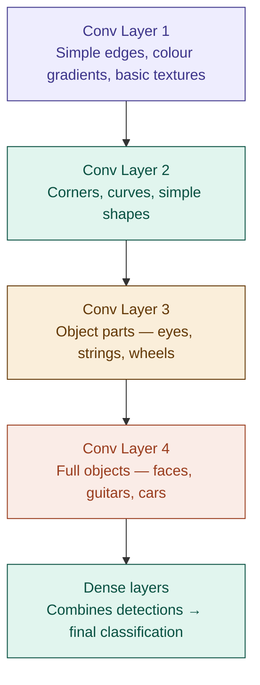

# 14 — Convolutional Neural Networks (CNNs)

> **Week 2 · Topic 14** · How neural networks learned to see — by scanning for patterns rather than memorising positions.

---

## The core idea

CNNs use small learnable filters that slide across input data to detect local patterns — the same filter applied everywhere. This parameter sharing makes them dramatically more efficient than dense networks for grid-structured data (images, audio spectrograms). Stacked convolutional layers build a spatial hierarchy: simple patterns in early layers combine into complex ones in deeper layers.

---

## Scope for your role

CNNs are primarily for images and audio. As an Agentic AI Engineer your day-to-day is text and LLMs. But interviewers use CNNs to test whether you understand convolution, spatial hierarchies, and parameter sharing — concepts that reappear in Transformer attention. Also: multimodal agents (vision + language) use CNNs or Vision Transformers for the vision component.

---

## The sketching analogy

When sketching a portrait you work locally — zoom into one area, sketch the detail, move to the next. Your pencil is always the same size. The technique for sketching an eye is similar to sketching an ear — detect edges, shade curves, define shapes. You apply the same fundamental technique to different regions.

That is a CNN:
- The pencil = the filter (kernel)
- The technique = learned weights inside the filter
- Sliding it across = the convolution operation
- Same weights applied everywhere = parameter sharing

---

## Why CNNs over dense networks for images

A dense network on a 256×256 RGB image has 256×256×3 = 196,608 input values. A first hidden layer of 512 neurons needs 196,608×512 = **~100 million weights** — just for one layer. Computationally catastrophic.

A CNN uses a 3×3×3 filter — just **27 weights** — and slides it across the entire image. 64 filters in the first layer = 64×27 = **1,728 weights** total. Orders of magnitude fewer parameters.

---

## The convolution operation

At each position, the filter computes a dot product between its weights and the overlapping input region — summing all multiplications into one number, then applying ReLU. That number goes into the feature map at the corresponding position. The filter slides one step and repeats.

```
For a 3×3 filter at one position:
z = Σ(filter_weights × input_pixels)  ← 9 multiplications summed
output = ReLU(z)                        ← one value in the feature map
```

The feature map captures where in the image this filter's pattern was detected and how strongly.

### Key convolution concepts

**Stride** — how many pixels the filter moves per step.
- Stride=1: overlap heavily, large output (same spatial size)
- Stride=2: skip pixels, smaller output, faster computation

**Padding** — zeros added around the border.
- "Same" padding: output same size as input
- "Valid" padding: no padding, output shrinks by (filter_size−1)

**Multiple filters** — each filter detects a different pattern. 64 filters → 64 feature maps simultaneously. More filters = more patterns detected per layer.

---

## Parameter sharing — the key efficiency

In a dense network: every neuron has its own unique weight for every input pixel — no sharing.

In a CNN: one filter has one set of weights and applies them everywhere in the image. If a filter learns to detect vertical edges, it detects vertical edges in the top-left, bottom-right, and everywhere else — using the exact same weights.

**Why this makes intuitive sense for images:** a vertical edge in the top-left corner is the same pattern as a vertical edge anywhere else. There is no reason to learn separate weights for each position.

**Translation invariance:** if a pattern shifts position in the image, the same filter still detects it. A guitar in the top-left and a guitar in the bottom-right are both detected by the same filters.

---

## Pooling — spatial compression

After convolution, pooling reduces spatial dimensions.

### Max pooling (most common)

Takes the maximum value in each pooling window (typically 2×2, stride=2):

```
Feature map region (2×2):     Max pooling output:
┌─────┬─────┐
│  1  │  3  │  →  6  (maximum value)
│  5  │  6  │
└─────┴─────┘
```

Concrete example — 4×4 feature map → 2×2 after max pooling:
```
Input:                    Output (max of each 2×2):
┌───┬───┬───┬───┐        ┌───┬───┐
│ 1 │ 3 │ 2 │ 4 │        │ 6 │ 4 │
├───┼───┼───┼───┤   →    ├───┼───┤
│ 5 │ 6 │ 1 │ 2 │        │ 4 │ 6 │
├───┼───┼───┼───┤        └───┴───┘
│ 3 │ 2 │ 4 │ 6 │
├───┼───┼───┼───┤
│ 1 │ 4 │ 2 │ 3 │
└───┴───┴───┴───┘
```

**Why max pooling creates translation invariance:** if a pattern moved slightly within the 2×2 window, the max pooling still captures it. Like asking "did this pattern appear anywhere in this region?" — not "did it appear at exactly this pixel?"

**Guitar analogy:** reviewing a recording — "did the guitar play a strong note in the first 4 beats?" You don't care exactly which beat — just take the strongest one. That is max pooling.

### Average pooling

Takes the average value in each window. Smoother reduction. Used in global average pooling at the end of modern architectures.

### Pooling purposes

1. Reduces spatial dimensions — less computation for subsequent layers
2. Translation invariance — exact position within window becomes irrelevant
3. Reduces overfitting — removes exact position information

No learned weights — purely a compression operation.

---

## Spatial hierarchy — how CNNs build understanding



No human programmed these hierarchical features — they emerge automatically from training. The network discovers that edges → shapes → parts → objects is useful. This is learned feature extraction replacing hand-crafted features.

---

## Full CNN lifecycle — album cover genre classification

**Problem:** classify 64×64 RGB album covers into 4 genres — Metal, Pop, Jazz, Classical.

**Architecture:**
```
Input:          64×64×3
Conv Layer 1:   32 filters, 3×3 → 64×64×32 → MaxPool → 32×32×32
Conv Layer 2:   64 filters, 3×3 → 32×32×64 → MaxPool → 16×16×64
Conv Layer 3:   128 filters, 3×3 → 16×16×128 → MaxPool → 8×8×128
Flatten:        8×8×128 = 8,192 values
Dense Layer 1:  256 neurons + BatchNorm + ReLU + Dropout(0.5)
Dense Layer 2:  128 neurons + BatchNorm + ReLU + Dropout(0.3)
Output:         4 neurons + Softmax
```

**Parameter count comparison:**
```
CNN conv layers total:   ~93,024 weights  (tiny)
Dense layers:            ~2.1M weights    (this is where parameters live)
Dense on raw pixels:     196,608×256 = ~50M weights for first layer alone
```

**Forward pass — one Metallica album cover:**
```
Conv Layer 1:
  Filter 1 slides across 64×64 image
  Detects horizontal edges → high values where edges found
  32 filters run simultaneously → 32 feature maps (64×64 each)
  ReLU zeros out negative activations

MaxPool 1: 64×64×32 → 32×32×32
  Each 2×2 region → maximum value
  Keeps strongest pattern detection per region

Conv Layer 2:
  64 filters see all 32 channels simultaneously
  Detect combinations: horizontal + vertical edge → corner
  → 32×32×64 feature maps

MaxPool 2: → 16×16×64

Conv Layer 3:
  128 filters detect genre-specific visual patterns
  → 16×16×128 feature maps

MaxPool 3: → 8×8×128

Flatten: 8,192 values

Dense + Dropout → Output:
  Metal=0.71, Pop=0.05, Jazz=0.21, Classical=0.03
  Prediction: Metal ✅
```

**Complete training lifecycle:**
```
SETUP: He initialisation for all filter + dense weights

PER BATCH:
├── Forward pass (conv → pool → conv → pool → flatten → dense → softmax)
├── Loss: categorical cross-entropy
├── Backward pass:
│   ├── Dense layers: standard backprop
│   ├── MaxPool: gradient only through max positions
│   └── Conv layers: backprop through ReLU + convolution
│       Filter weights get gradients — learn better patterns
└── Adam weight update

INFERENCE:
├── Dropout OFF, BatchNorm uses running averages
└── Forward pass only → genre probabilities
```

---

## CNN vs Dense networks

| Property | Dense | CNN |
|---|---|---|
| **Parameters** | Huge — every pixel × every neuron | Small — filter weights shared everywhere |
| **Spatial structure** | Ignored — all pixels treated equally | Exploited — local patterns detected |
| **Translation invariance** | None | Yes — same filter detects pattern anywhere |
| **Best for** | Tabular data, flat feature vectors | Images, audio spectrograms, grid-structured data |

---

## CNNs vs Vision Transformers (ViTs)

CNNs have one fundamental limitation: local receptive fields. A 3×3 filter only sees 3×3 pixels at a time. To connect distant regions (sky in top-left to ground in bottom-right), information must pass through many layers — slow and lossy.

Vision Transformers split the image into patches (e.g. 16×16 pixels) and treat each patch as a token — exactly like words in a sentence. Attention allows every patch to directly attend to every other patch in one step.

```
CNN: local → local → local → (eventually) global understanding
ViT: all patches attend to all patches directly at every layer
```

| | CNN | Vision Transformer |
|---|---|---|
| **Receptive field** | Local (grows with depth) | Global (every layer) |
| **Translation invariance** | Built-in via parameter sharing | Must be learned |
| **Data efficiency** | Better on small datasets | Better on large datasets |
| **Best for** | Small-medium datasets, efficiency | Large datasets, complex relationships |

---

## ⚠️ Common confusions

**Confusion: CNN filters are hand-designed to detect edges.**
Filters are randomly initialised and learned during training. The network discovers that edge detection is useful — nobody programmed it. This is the power: learned feature extraction, not hand-crafted.

**Confusion: pooling has learnable weights.**
Pooling has no parameters — it is a fixed operation (take max or average). Only convolutional and dense layers have learned weights.

**Confusion: CNNs can only be used for images.**
CNNs work on any grid-structured data where local patterns matter. Audio (1D convolution on spectrograms), text (1D convolution — now largely replaced by Transformers), video (3D convolution across spatial + time dimensions).

**Confusion: more filters always means better.**
More filters = more parameters = more risk of overfitting on small datasets. Start with standard architectures (32→64→128 filters) and increase only if underfitting.

---

## Interview-ready summary

> "CNNs use learnable filters that slide across input data — computing a dot product at each position to produce a feature map showing where and how strongly that pattern was detected. Parameter sharing means one filter's weights are applied everywhere, reducing parameters from millions (dense) to thousands (CNN) while also providing translation invariance. Stacked convolutional layers build a spatial hierarchy: edges in early layers, shapes in middle layers, objects in deep layers. Max pooling compresses spatial dimensions and reinforces translation invariance by asking 'was the pattern detected anywhere in this region?' not 'at exactly this pixel?' Vision Transformers are replacing CNNs for images on large datasets because attention allows every patch to directly attend to every other patch — unlike CNNs where distant regions must communicate through many layers."

---

## Resources
- **Udemy:** Deep Learning A-Z — Kirill Eremenko (Part 2: CNNs)
- **YouTube:** 3Blue1Brown — "But what is a convolution?"
- **YouTube:** StatQuest — "CNNs, Clearly Explained"

---

*Part of [ml-dl-for-ai-engineers](https://github.com/PulkitKushwaha/ml-dl-for-ai-engineers) — a learning journal built while targeting Agentic AI Engineer roles at product companies.*
