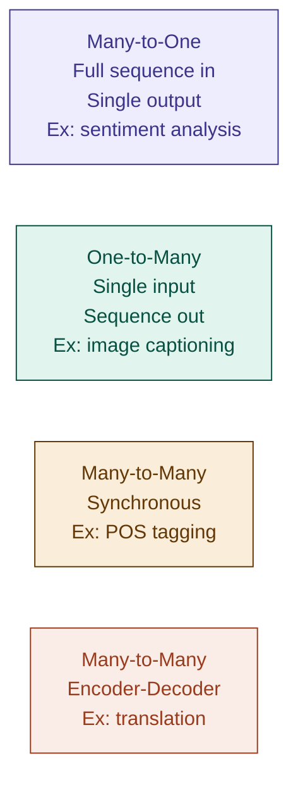

# 15 — Recurrent Neural Networks (RNNs)

> **Week 2 · Topic 15** · The first architecture that gave neural networks memory — and the problem it introduced.

---

## The core idea

Standard neural networks treat every input in complete isolation — no memory of what came before. For sequences (text, audio, time series), order and context matter enormously. RNNs solve this by maintaining a **hidden state** — a running memory updated at every timestep by combining what the network remembers with what it just saw.

---

## The problem RNNs were invented to solve

"Dog bites man" and "Man bites dog" contain identical words but completely different meanings. A dense network fed these word by word with no memory would produce identical representations — it has no concept of order. RNNs were the first architecture to process sequences with genuine temporal memory.

---

## The guitar solo analogy

A **standard neural network** is like listening to each note with earplugs between every note. Each note analysed in isolation — no melody, no harmonic context, no memory of what came before. By note 10 you have no idea what key you are in.

An **RNN** is like actually listening to music. After each note you update your mental model: "E... then G... then A... this is building toward A minor." Your current understanding is the hidden state. At each new note you combine:
- Your current mental model of the song so far (hidden state)
- The new note you just heard (current input)

And produce an updated mental model. The same weights are used at every note — the RNN learns one general rule: "given what I remember and what I just heard, update my understanding."

---

## The hidden state

The hidden state hₜ is a fixed-size vector — the compressed memory of everything seen so far in the sequence. It is not stored cumulatively — it is **replaced** at every timestep with a new summary combining:
- Everything remembered up to t-1 (hₜ₋₁)
- The current input xₜ

Think of it as a whiteboard that gets erased and rewritten at every step — but the new writing incorporates what was there before.

---

## The RNN equation

```
hₜ = tanh(Wₓ · xₜ + Wₕ · hₜ₋₁ + b)
```

- **xₜ** — current input at timestep t (e.g. word embedding of current word)
- **hₜ₋₁** — hidden state from previous step — memory of everything before
- **Wₓ** — weight matrix for the input (how much to weight current input)
- **Wₕ** — weight matrix for the hidden state (how much to weight memory)
- **tanh** — activation squashing output to -1 to +1
- **hₜ** — new hidden state — updated memory including current input
- **b** — bias term

The output at each step (if needed):
```
ŷₜ = Wᵧ · hₜ
```

---

## Parameter sharing across time — why the same weights everywhere

The RNN uses the same Wₓ and Wₕ at every timestep. This is the same idea as CNN parameter sharing across space — but applied to time instead.

**Why it makes sense:** the operation at every timestep is identical — "given what I remember and what I just saw, update my understanding." The rule for combining memory + input does not change whether you are at word 1 or word 50. There is no reason word 3 should have different combination rules than word 17.

**Practical benefits:**
- Handles variable-length sequences — same weights work regardless of sequence length
- Parameter count stays constant regardless of sequence length
- If each timestep had its own weights, you would need a fixed maximum length upfront and the parameter count would explode

This is parameter sharing across time — analogous to how CNNs share weights across spatial positions.

---

## Unrolled view — processing "The solo was epic"

```
h₀=0   →   [RNN t=1]   →   h₁   →   [RNN t=2]   →   h₂   →   [RNN t=3]   →   h₃   →   [RNN t=4]   →   h₄
               ↑                          ↑                          ↑                          ↑
            "The"                      "solo"                      "was"                     "epic"

Same Wₓ and Wₕ used at every cell.

h₁ encodes: "The"
h₂ encodes: "The solo"
h₃ encodes: "The solo was"
h₄ encodes: "The solo was epic" ← full sequence context
```

h₄ is the final context vector — a compressed representation of the entire sequence. For classification (e.g. sentiment analysis), h₄ feeds into a dense output layer. For generation tasks, each hₜ can produce an output at every step.

---

## RNN variants — matching architecture to task



**Many-to-one:** read full sequence, output single prediction. Use final hidden state h_T. Example: sentiment classification — read full music review, predict positive/negative.

**One-to-many:** single input, generate sequence. Example: image captioning — single image vector in, generate caption word by word.

**Many-to-many (synchronous):** output at every timestep, same length as input. Example: part-of-speech tagging — label each word in a sentence simultaneously.

**Many-to-many (encoder-decoder):** variable length in, variable length out. Two separate RNNs — encoder reads the full input, decoder generates the output. Example: machine translation — encode full English sentence, decode into French word by word.

---

## The vanishing gradient problem — why RNNs have short memory

### Backpropagation Through Time (BPTT)

During backprop, gradients flow backwards through every timestep — all the way to t=1. At each step the gradient is multiplied by the recurrent weight Wₕ and the tanh derivative:

```
gradient at t=1 ≈ gradient at t=T × (Wₕ × tanh')^(T-1)
```

With tanh derivative ≈ 0.5 over 20 timesteps:
```
0.5²⁰ ≈ 0.000001
```

The gradient at timestep 1 is essentially zero. The weights at early timesteps receive no meaningful update — early context is effectively forgotten.

**Practical limit:** vanilla RNNs can only reliably learn dependencies up to ~10–20 timesteps apart. Anything longer — forgotten.

**Real example:** "The guitarist who toured with Miles Davis in 1967 was ___" — the blank depends on "guitarist" from 15 words ago. A vanilla RNN will have largely forgotten it by the time it reaches the blank.

---

## Why activation functions cannot fix RNN vanishing gradients

A natural question: if ReLU fixed vanishing gradients in feedforward networks, why not use it here?

**In feedforward networks:** vanishing gradient comes from activation function derivatives (tanh max 0.25). ReLU fixes it — derivative = 1 when active.

**In RNNs:** vanishing gradient comes from the recurrent weight matrix Wₕ being multiplied repeatedly across timesteps. Even with ReLU (activation derivative = 1), you still have:

```
gradient at t=1 ≈ gradient at t=T × (Wₕ)^(T-1)
```

If eigenvalues of Wₕ < 1 → gradient vanishes. ReLU doesn't help.

**Making it worse:** if you do use ReLU in an RNN hidden state and eigenvalues of Wₕ > 1, gradients **explode** instead — the network becomes completely unstable with weights flying to infinity. Tanh at least bounds outputs to -1 to +1, preventing explosion even if it causes vanishing.

**The conclusion:** vanishing gradients in feedforward networks require a better activation function (ReLU). Vanishing gradients in RNNs require a better **architecture** — which is exactly what LSTMs provide, via the cell state highway. Topic 16.

---

## ⚠️ Common confusions

**Confusion: the hidden state accumulates information permanently.**
The hidden state is replaced at every timestep — not accumulated. It is a fixed-size vector rewritten at each step to be a compressed summary of everything so far. Old information gets progressively compressed and can be overwritten.

**Confusion: different timesteps should have different weights.**
The whole point of parameter sharing is that the same operation happens at every step. Training separate weights per position would require a fixed maximum sequence length and cause parameter explosion. Shared weights also allow the RNN to generalise to sequences longer than those seen during training.

**Confusion: ReLU fixes vanishing gradients in RNNs like it does in feedforward nets.**
No — the vanishing gradient in RNNs is caused by repeated multiplication of the recurrent weight matrix, not the activation function. ReLU does not help and can cause gradient explosion instead. The fix requires an architectural change — LSTMs.

**Confusion: many-to-many always means same-length input and output.**
There are two many-to-many variants. Synchronous produces output at every input step (same length). Encoder-decoder produces variable-length output from variable-length input — read everything first, then generate. Translation uses encoder-decoder, POS tagging uses synchronous.

---

## Interview-ready summary

> "RNNs process sequences by maintaining a hidden state — a fixed-size vector updated at every timestep by combining the previous hidden state with the current input using the same weight matrices. Parameter sharing across time means one set of weights handles any sequence length. The final hidden state encodes the entire sequence context. The core failure: backpropagation through time multiplies the recurrent weight matrix at every step — over long sequences gradients vanish to near zero, so the RNN cannot learn dependencies beyond ~10–20 timesteps. ReLU cannot fix this because the problem is the repeated weight multiplication, not the activation — using ReLU risks gradient explosion instead. The architectural fix is LSTMs, which introduce a cell state highway where gradients travel through addition rather than multiplication."

---

## Resources
- **Udemy:** Deep Learning A-Z — Kirill Eremenko (Part 3: RNNs)
- **YouTube:** StatQuest — "Recurrent Neural Networks (RNN), Clearly Explained"
- **YouTube:** 3Blue1Brown — after completing Transformers topic

---

*Part of [ml-dl-for-ai-engineers](https://github.com/PulkitKushwaha/ml-dl-for-ai-engineers) — a learning journal built while targeting Agentic AI Engineer roles at product companies.*
