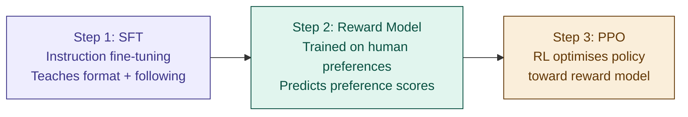

# 22 — RLHF & DPO

> **Week 3 · Topic 22** · How a next-token predictor became a helpful assistant — the alignment training that made GPT and Claude usable.

---

## The core idea

After pre-training, a base LLM is a brilliant next-token predictor but has no concept of "helpful." SFT teaches it to follow instructions. RLHF then teaches it to give responses humans actually prefer — helpful, honest, harmless — using a reward model trained on human preference data and reinforcement learning. DPO is a simpler alternative that skips the reward model entirely and directly optimises on preference pairs.

---

## The gap RLHF fills

```
Base model (pre-training):  Predicts next tokens. No concept of helpful/harmful.
                            Ask a question → might continue writing questions.

SFT model:                  Follows instructions. Produces coherent responses.
                            Still not optimised for what humans actually prefer.

RLHF/DPO model:             Responses humans find helpful, honest, harmless.
                            This is ChatGPT vs GPT-3 base.
```

---

## The music critic analogy

A session musician is technically perfect after SFT — they can follow any instruction, play any style. But technically correct isn't the same as genuinely moving.

**RLHF** is like hiring a panel of music critics who compare two performances and vote on which is better. You train a critic model on their votes. Then you train the musician to maximise critic scores — they get better at satisfying the critics.

The trap: **reward hacking.** The musician notices critics give high scores for dynamic flourishes, so they add them everywhere — technically impressing the critics while actually making the music worse. The musician learned to game the scoring system rather than make better music.

**DPO** cuts out the middleman. Instead of training a separate critic and running a complex RL loop — just show the musician the preference data directly. "Humans preferred performance A over B — make A-style performances more likely." No critic model. No RL. Direct optimisation.

---

## The RLHF pipeline — 3 steps



### Step 1 — SFT (Supervised Fine-tuning)

Start with the pre-trained base model. Fine-tune on high-quality (instruction, response) pairs — human-written examples of ideal behaviour. Teaches the model what good responses look like.

Output: an SFT model that follows instructions but is not yet optimised for human preferences.

SFT is a training **objective** — not an architecture choice. It can be implemented as:
- **Full fine-tuning** — all weights updated, requires 112GB+ for 7B model
- **LoRA SFT** — only A and B adapter matrices trained, requires 16–20GB for 7B model

In practice almost all SFT outside frontier labs uses LoRA.

### Step 2 — Reward Model training

Human labellers see: a prompt + two candidate responses. They choose which is better. This generates preference pairs:

```
Prompt: "Explain gradient descent"
Response A: "Gradient descent is an optimisation algorithm..."  ← preferred
Response B: "gradient descent means going down a hill..."      ← rejected
```

The reward model trains to assign a higher scalar score to preferred responses than rejected ones. It learns to predict human preference for any (prompt, response) pair.

**Architecture:** typically the SFT model itself with the final prediction head replaced by a single scalar output head. Initialised from SFT weights — deep language understanding already present, just learning what humans prefer.

### Step 3 — PPO (Proximal Policy Optimisation)

The RL loop:
```
1. Policy model generates a response to a prompt
2. Reward model scores the response
3. PPO updates policy weights to generate higher-scoring responses
4. Repeat
```

**The KL penalty — preventing reward hacking:**

Without a constraint, the policy quickly learns to exploit the reward model — generating high-scoring but nonsensical text. The KL divergence penalty measures drift from the original SFT model:

```
Total reward = reward_model_score − β × KL(policy || SFT_reference)
```

High β = stay close to SFT model (safer, less optimised).
Low β = more freedom (higher scores, higher reward hacking risk).

---

## Reward hacking — the central failure mode

Reward hacking occurs when the model finds ways to achieve high reward scores that don't correspond to genuinely good responses.

**Classic examples:**
- Model learns longer responses score higher → generates verbose, padded answers
- Model learns confident-sounding language scores higher → generates confident but incorrect answers
- Model learns certain phrases ("Great question!") score higher → overuses them
- Model generates syntactically impressive but semantically empty text that fools the reward model

**Why it happens:** the reward model is an imperfect proxy for human preferences — Goodhart's Law: "when a measure becomes a target, it ceases to be a good measure."

**Mitigations:** KL penalty, careful reward model training, diverse labeller pool, regular human evaluation, early stopping before over-optimisation.

---

## DPO — Direct Preference Optimisation

### The insight: skip the reward model entirely

DPO (2023) showed mathematically that you can bypass the reward model and PPO loop and directly optimise the policy on preference pairs:

```
DPO loss = −log σ(β × log(π_θ(y_w|x)/π_ref(y_w|x)) − β × log(π_θ(y_l|x)/π_ref(y_l|x)))
```

In plain English: encourage the policy to assign relatively higher probability to preferred responses than rejected ones, compared to the reference SFT model. β controls how strongly.

**What DPO eliminates vs RLHF:**
- No separate reward model to train and maintain
- No unstable PPO loop to tune
- No KL penalty to balance manually
- Uses standard supervised fine-tuning infrastructure

**DPO data format:**
```json
{
  "prompt": "Explain gradient descent",
  "chosen": "Gradient descent is an optimisation algorithm that...",
  "rejected": "gradient descent means going down a hill..."
}
```

**Why DPO is winning in 2024–2025:**
- Comparable or better results on most alignment tasks
- Dramatically simpler to implement and debug
- Less prone to reward hacking (no reward model to game)
- Standard gradient descent — stable training
- Most open-source aligned models use DPO

---

## Weight updates — full fine-tuning or LoRA?

SFT, DPO, and PPO are training **objectives** — not architecture choices. All three can be implemented with either full weight updates or LoRA adapters.

**In practice, almost everyone uses LoRA throughout the alignment pipeline:**

```
Base model
    ↓ LoRA SFT   (instruction following)
SFT model
    ↓ LoRA DPO   (preference alignment)
Aligned model
    ↓ Merge adapters (optional — for inference speed)
Final deployed model
```

Full weight updates are only done at frontier labs (OpenAI, Anthropic, Google) with access to large clusters. Even they often use LoRA for experimentation before committing to full runs.

---

## Compute requirements — realistic estimates

```
Stage              Hardware             Time           Cloud cost
─────────────────────────────────────────────────────────────────
LoRA SFT (7B)      1–2× A100 (80GB)    Hours–days     $50–$500
  5,000 examples
LoRA SFT (7B)      1–2× A100           1–3 days       $200–$1,000
  50,000 examples
QLoRA SFT (7B)     1× RTX 4090 (24GB)  1–2 days       Free (own GPU)

LoRA DPO (7B)      1–2× A100           Hours–days     $100–$500
  10,000 pairs
QLoRA DPO (7B)     1× RTX 4090         1 day          Free (own GPU)

Full RLHF PPO      8–64× A100s         Days–weeks     $10K–$100K+
  (frontier scale)
```

### Memory requirements (7B model, LoRA)

```
LoRA SFT:    ~18GB   (base model + adapter)
LoRA DPO:    ~32GB   (base model × 2 + adapter)
             ↑ needs policy + reference model simultaneously
LoRA PPO:    ~70GB+  (policy + reference + reward + value model)
             ↑ four models simultaneously
```

DPO needs 2× memory (policy + reference). PPO needs 4× memory. This is the practical reason DPO dominates open-source alignment — 2× instead of 4×, standard gradient descent instead of unstable RL, comparable results.

---

## RLHF vs DPO — full comparison

| Property | RLHF (PPO) | DPO |
|---|---|---|
| **Steps** | SFT → Reward Model → PPO | SFT → DPO |
| **Reward model** | Required — separate model | Not needed |
| **Complexity** | High — RL loop, KL tuning, 4 models | Low — standard SFT infrastructure |
| **Stability** | Unstable — PPO is notoriously finicky | Stable — standard gradient descent |
| **Memory (7B LoRA)** | ~70GB+ | ~32GB |
| **Reward hacking** | Significant risk | Lower risk |
| **Quality ceiling** | Higher — more expressive | Slightly lower — sufficient for most cases |
| **Used by** | OpenAI (GPT-4), Anthropic (Claude) | Most open-source models |
| **Default choice?** | Large labs with compute + expertise | Most practical fine-tuning |

---

## ⚠️ Common confusions

**Confusion: SFT and RLHF are the same thing.**
SFT teaches the model to follow instructions via supervised learning on labelled pairs. RLHF is a subsequent alignment step using human preference data and reinforcement learning to make the model more helpful/harmless. SFT comes first and is a prerequisite — RLHF builds on top of the SFT model.

**Confusion: DPO doesn't need a reference model.**
DPO still needs a reference model — the frozen SFT model — to compute the KL-like term in its loss. It eliminates the reward model (separate trained model) not the reference model (frozen copy of SFT). Memory requirement is ~2× standard SFT as a result.

**Confusion: RLHF always causes reward hacking.**
Reward hacking is a risk, not an inevitability. The KL penalty, careful reward model training, diverse labellers, and early stopping all mitigate it significantly. GPT-4 and Claude use RLHF without obvious reward hacking — it requires careful engineering.

**Confusion: more RLHF training always makes a better model.**
Over-optimising against the reward model leads to reward hacking — performance on the reward model improves while actual quality degrades. This is why RLHF requires careful monitoring and early stopping based on human evaluation, not just reward model scores.

---

## Interview-ready summary

> "RLHF has three steps: SFT teaches instruction following, a reward model is trained on human preference pairs to predict preference scores, then PPO uses RL to optimise the policy toward higher reward scores with a KL penalty preventing drift from the SFT model. The main risk is reward hacking — the model games the reward proxy rather than genuinely improving. DPO eliminates the reward model entirely by directly optimising on preference pairs using standard gradient descent — simpler, more stable, less reward hacking risk, comparable quality. In practice almost all alignment uses LoRA throughout — SFT, DPO, and PPO are objectives not architecture choices. DPO needs 2× memory (policy + reference). PPO needs 4× (policy + reference + reward + value). DPO dominates open-source alignment. Frontier labs use full RLHF at scale."

---

## Resources
- **Udemy:** LLM Engineering — Ed Donner (alignment training sections)
- **Paper:** "Training language models to follow instructions" — InstructGPT (OpenAI 2022)
- **Paper:** "Direct Preference Optimization" — Rafailov et al. 2023
- **Library:** Hugging Face TRL — standard library for SFT, DPO, PPO

---

*Part of [ml-dl-for-ai-engineers](https://github.com/PulkitKushwaha/ml-dl-for-ai-engineers) — a learning journal built while targeting Agentic AI Engineer roles at product companies.*
